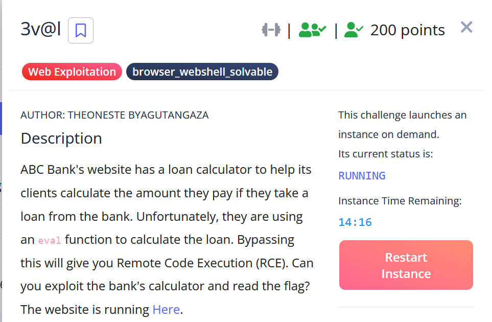

# All Challenge 
> CTF Time Event Link:
> https://play.picoctf.org/events/74
> 7. 3v@l
> 8. Apriti sesamo
> 9. Pachinko
> 10. Pachinko Revisited (unsolve)
> 11. secure-email-service (unsolve)
## Background
> Start: 12:00am GMT+7 Mar 8, 2025  
> Ends: 12:00am GMT+7 Mar 10, 2025  
## 3v@l
### Tổng quan
> Người đóng góp : <b>tr1ck3r</b>  
> Được giải quyết bởi: <b>bl4ck0ut</b>  
> 1,885 giải quyết / 200 point  
> Độ khó chung đối với chúng tôi (từ 1 - 10 sao): ★☆☆☆☆☆☆☆☆☆
### Lý lịch
Description
ABC Bank's website has a loan calculator to help its clients calculate the amount they pay if they take a loan from the bank. Unfortunately, they are using an eval function to calculate the loan. Bypassing this will give you Remote Code Execution (RCE). Can you exploit the bank's calculator and read the flag?

### Liệt kê
Trang mục lục:

Đầu tiên mới bước vào thì họ sẽ cho chúng ta một giao diện kiểu dùng để tính toán Mình thử nhập giá trị `1 + 1` rồi `excute` xem thì nó báo ra kết quả là 2 

Tới đây tiếp theo như nào mình thử show source nó xem sao 

Phát hiện chúng đã có bộ lọc regex để tránh thực thi các lệnh để truy xuất flag. Nhìn sơ qua thì chúng ta thấy regex của nó đã lọc tất cả các giá trị dấu `.`, `/`.... Filter hết rồi. Tới đây mình phải làm sao liệu mình có thể RCE chúng không. 
> Ở đây nó sử dụng bộ lọc đầu vào của `Web Flask` nơi mã Python do người dùng nhập vào sẽ được thực thi bằng `eval()` bộ lọc này sẽ ngăn chặn một số từ khóa trên.
---------Móa Tới đây rồi giải lâu rồi nên tự nhiên quên mất `Payload` để test----------Ẹc mình sẽ cập nhật sau !.....
## Apriti sesamo
### Tổng quan
> Người đóng góp : <b>tr1ck3r</b>  
> Được giải quyết bởi: <b>bl4ck0ut</b>  
> 1,016 giải quyết / 300 point  
> Độ khó chung đối với chúng tôi (từ 1 - 10 sao): ★★★☆☆☆☆☆☆☆
### Lý lịch
I found a web app that claims to be impossible to hack!

### Liệt kê
Trang mục lục:

Khi bắt đầu vào trang web mình thấy xuất hiện 1 trang login thì điều đầu tiên nảy lên trong đầu mình là test lỗi `SQL Injection` nhưng không không hề dễ như vậy !.Rồi tới đây xem thêm tiếp nào. Nhập thử login bậy bạ vào xem.

Nó báo `Failed! No flag for you!`
Tới đây khá lâu mình chưa nảy ra ý tưởng sẽ làm gì tiếp theo. mình ra ngoài `description of challenge` tác giả có nói đến `backupfile` và `emacs` ồ khá thú vị.
Tới đây mình thử vào `burp suite` bắt request lại xem như nào. 

Có lẽ đây hình như là 1 phần nào đó rò rỉ thông tin để truy xuất 1 dữ liệu ẩn bên trong nó bằng cách sử dụng `~` sau file chính của web để thử xem có rò rỉ gì không.
> À giải thích `~` tức là trong một số trường hợp chúng ta có thể đánh lừa trang web trả về nội dung của tệp thay thế. Các tệp tạm thời này nó thường được chỉ định theo một cách nào đó chẳng hạn như thêm dấu `~` vào tên tệp hoặc thêm mở rộng tệp khác. Yêu cầu tệp bằng phần mở rộng tệp sao lưu sẽ cho phép bạn đọc được tệp nội dung đó.
Đúng như dự đoán ta backupfile được 1 file `php`

Chúng ta tiến hành đi `decode` nó ra và phân tích nhé!. Sau khi giải mã 
`<?php
 if(isset($_POST["dXNlcm5hbWU="]) && isset($_POST["cGFzc3dvcmQ="])) {
    $yuf85e0677 = $_POST["dXNlcm5hbWU="];
    $rs35c246d5 = $_POST["cGFzc3dvcmQ="];

    if($yuf85e0677 == $rs35c246d5) {
        echo "PGJyLz5GYWxzZQ=="; // base64 của " False"
    } else {
        if(sha1($yuf85e0677) === sha1($rs35c246d5)) {
            echo file_get_contents("Li4vZmxhZ3MucGhw"); // base64 của "../flags.php"
        } else {
            echo "PGJyLz5GYWxzZQ=="; // base64 của " False"
        }
    }
 }
?>
`
Với đoạn code trên chúng ta phân tích là với chương trình nó sẽ kiểm tra hai giá trị từ `POST` là `POST["username"]` và `POST["password"]` tới đây nó sẽ so sánh hai giá trị nếu 2 giá trị trùng nhau mà truyền vào á thì nó in ra `False` ngược lại nếu hai giá trị khác nhau nhưng có cùng một thuật toán `SHA1` thì nó sẽ đọc nội dung file `../flags.php` và trả về `False` nếu không đúng điều kiện. Và đây là một lỗ hổng đặc biệt `Attack Collision` có thể tìm hiểu tại đây: `https://en.wikipedia.org/wiki/Collision_attack`
### Khai thác
Từ những thông tin trên mình sẽ khai thác với một tập lệnh `python` đưa vào 2 giá trị khác nhau nhưng cùng 1 thuật toán `SHA1`. 
https://shattered.io/static/shattered-1.pdf 
https://shattered.io/static/shattered-2.pdf

> Flags: picoCTF{w3Ll_d3sErV3d_Ch4mp_5292ca30}
### Kết luận
Những gì chúng tôi học được:
> Khai thác lỗ hổng qua attack collision and backupfile
## Pachinko
### Tổng quan
> Người đóng góp : <b>tr1ck3r</b>  
> Được giải quyết bởi: <b>bl4ck0ut</b>  
> 978 giải quyết / 300 point  
> Độ khó chung đối với chúng tôi (từ 1 - 10 sao): ★★★★☆☆☆☆☆☆
### Lý lịch
History has failed us, but no matter. Server source There are two flags in this challenge. Submit flag one here, and flag two in Pachinko Revisited.

### Liệt kê
Trang mục lục: 

Đầu tiên vào trang web đập vào mắt mình là một trò chơi gì như chơi bi vậy!. 
Khi mình thử click vào mục `submit` thử thì nó notice 

Không có gì thú vị hãy đi vào mã nguồn code để phân tích thử.

Ở đây sẽ có 3 file chính `cpu.js`, `index.js`, `utils.js` cần phân tích
Ở file `untils.js` mình để ý đến hàm

Hàm này sẽ kiểm tra giá trị mình truyền vào nó bắt buộc là kiểu số nguyên dương hợp lệ nằm trong khoảng giá trị lớn hơn 0 và nhỏ hơn 0xFFFF (65535)

Ở tyến đường hàm này được hiểu là biểu diễn dưới dạng mảng bộ nhớ Uint8Array(65536) //64KB. Lưu chương trình CPU `memory.set(program)` sao chép chương trình vào đầu bộ nhớ.
> Lưu trạng thái đầu ra tại địa chỉ `0x1000`
> Lưu trạng thái đầu vào tại địa chỉ `0x2000`
> Và với mỗi cổng `gate` nó sẽ lưu 3 giá trị `input1`, `input2`, `output`
Tóm lại hàm này dùng để chuyển một trạng thái CPU thành mảng bộ nhớ 64KB và mục tiêu ở tuyến đường này mình sẽ đưa 3 giá trị lần lượt vào với giá trị >0 và <= (65535)
Khám phá tiếp theo file `cpu.js` ta chú ý đến hàm `RunCPU`

Ở hàm này chúng ta cùng phân tích: `memory` là một mảng nó chứa dữ liệu bộ nhớ cho CPU, `state` một mảng `Unit8Array` có kích thước 100_000 byte để lưu trữ trạng thái CPU, `signals` là một đối tưognj chứa tín hiệu điều khiển của CPU. Và process(state) nó sẽ cập nhật trạng thái CPU và đặt reset thành 255 để kích hoạt và đặt 0 để thoát chế độ reset. Nó gán biến `flag` để kiểm tra trạng thái CPU.
Lấy địa chỉ (addr) từ signals.addr.
Chia inp_val thành 2 phần (first_byte, second_byte).
Gán giá trị bộ nhớ vào CPU:
Byte thấp (memory[addr]) vào first_byte.
Byte cao (memory[addr + 1]) vào second_byte và sau đó nó kiểm tra trạng thái CPU nếu CPU dừng (`halted == 255`) nó sẽ thoát vòng lặp và nếu cờ `flag = 255` nó sẽ đặt `flag` = `true` và trả về `flag`.
Tiếp đến ở file `index.js` ta thấy:

Ở đây nó có 2 biến flag `FLAG1` và `FLAG2` có thể lấy từ môi trường hàm `doRun` nó sẽ thực hiện nếu `runCPU` trả về `true` thì nó hiển thị `FLAG2` và nếu `runCPU` nó trả về `false` nó sẽ kiểm tra giá trị tại địa chỉ `0x1000` trong memory nếu `memory[0x1000] | (memory[0x1001] << 8) === 0x1337` nó sẽ trả về `FLAG1` nếu kết quả `0x333` thì trả về `wrong`.
> Điều kiện lấy flag1 là `runCPU` phải trả về false và giá trị memory[0x1000] phải là 0x1337 (tức là 0x1000 = 0x37 và 0x1001 = 0x13).

Endpoint này yêu cầu nhập flag1 và flag2 đúng.
Nếu có flag1 và flag2, nó đọc nand_checker.bin và chạy CPU.
Ta không thể truy cập trực tiếp nand_checker.bin
-> Ý tưởng khai thác nếu ta có thể tạo được 1 mạch sao cho `memory[0x1000] = 0x1337` thì ta sẽ trích xuất được `FLAG1`
### Khai thác.
Từ những thông tin trên ta có thể đưa 1 payload vào sao cho khớp với giá trị `0x1337` thì có thể trích xuất được flag1.
`{
  "circuit": [{"input1": 1, "input2": 1, "output": 4919}],
  "inputState": [1, 65535, 1, 65535],
  "outputState": [1, 4919]
}
`
outputState[0] = 1 để ghi số lượng output đúng.
outputState[1] = 4919 (0x1337) để đặt kết quả mong muốn.
> Nhưng sau bao nhiêu lân thử giá trị thì mình vẫn nhận lại được

Vấn đề do `serializeCircuit()` ghi dữ liệu `outputstate` vào `0x1000` nhưng `outputview[0]` lại lưu số lượng làm lệch giá trị. Và có thể `outputState` có thể gửi bị ghi đè.
Bằng cách mình sẽ thay đổi payload đưa vào
`{  
  "circuit": [  
    { "input1": 1, "input2": 2, "output": 4919 } 
  ], 
  "inputState": [1, 2, 3, 4], 
  "outputState": [2, 4919, 4919] 
}
`
mình sẽ giải thích tại sao ở mục `outputstate` lại là các giá trị đó. `outputstate[0] = 2` là số lượng phần tử trong outputstate. `outputstate[1] = 4919 là giá trị 0x1337 ghi vào bộ nhớ memory[0x1000]` , `outputstate[2]=4919 đảm bảo byte thấp và byte cao khớp` mục đích đưa vào để tránh ghi lệnh địa chỉ vào bộ nhớ memory. 

> Flags: picoCTF{p4ch1nk0_f146_0n3_e947b9d7}
# Kết thúc Challenge.
> Xin cảm ơn!. 
