# Challenge Leak Force
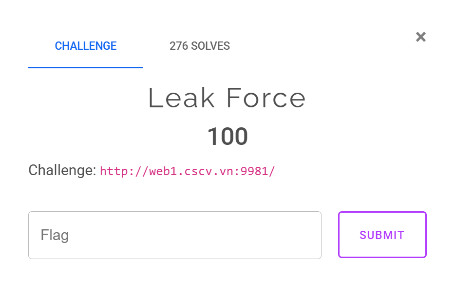
Đầu tiên vào challenge chúng ta sẽ thấy nó hiển thị 1 trang đăng nhập và tìm kiếm chúng ta cùng tạo tài khoản và đăng nhập xem và ở lịch sử HTTP như sau: <br>
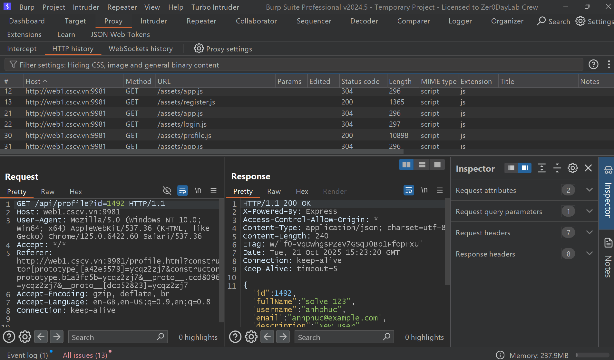
Như chúng ta thấy khi đăng nhập vào nó sẽ fetch đến <b>/api/profile?id=1492</b> ngẫu nhiên và trả về response với thông tin của người dùng <br>
```json
{"id":1492,"fullName":"solve 123","username":"anhphuc","email":"anhphuc@example.com","description":"New user","avatar":"https://i.pinimg.com/1200x/d3/88/5e/d3885e4a5748dddbb9b874dc0cf6fabd.jpg","birthdate":null,"gender":null,"company":null}
```
Sau khi xem xét qua tôi phát hiện ứng dụng web này có lỗ hổng IDOR có thể xem qua được thông tin tài khoản người khác như sau bằng cách thay đổi tham số id <br>
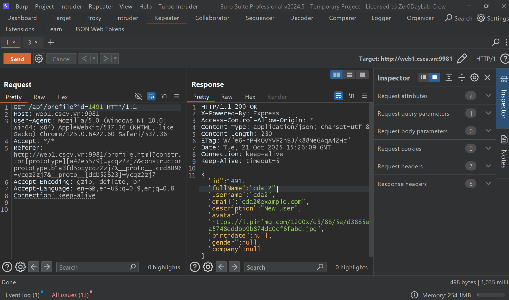
Và ở source code cho thấy rằng chúng ta có user trang admin sau khi đăng nhập vào được user thì sẽ hiển thị flag như sau: <br>
```html
<!-- Admin panel (visible only for admin user) -->
    <div id="adminPanel" class="card p-3 mt-4 d-none">
      <h5 class="card-title">Admin: User Management</h5>
      <div class="table-responsive">
        <table class="table table-sm table-striped mb-0">
          <thead>
            <tr>
              <th>ID</th>
              <th>Username</th>
              <th>Name</th>
              <th>Email</th>
              <th>Actions</th>
            </tr>
          </thead>
          <tbody id="adminUserTable"></tbody>
        </table>
      </div>
    </div>
    [.....]
    <!-- Modal for flag -->
  <div class="modal fade" id="flagModal" tabindex="-1" aria-hidden="true">
    <div class="modal-dialog modal-dialog-centered">
      <div class="modal-content p-4">
        <h5 class="modal-title"><i class="bi bi-trophy"></i> FLAG</h5>
        <pre id="flagContent" class="bg-light p-2 rounded"></pre>
        <div class="text-end">
          <button type="button" class="btn btn-secondary" data-bs-dismiss="modal">Close</button>
        </div>
      </div>
    </div>
  </div>
```
Được rồi vậy chúng ta có thể xác định được lỗ hổng bây giờ với cách nào chúng ta có thể lấy được user Admin may mắn thay ứng dụng này có chức năng update password của người dùng chúng ta có thể update password của user hiện tại xem<br>
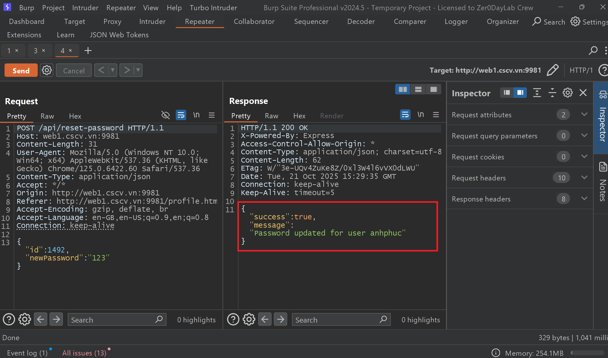
À tôi đã tìm thấy Id của admin là 1 vậy bây giờ giả sử chúng ta có thể lợi dụng update password để cập nhật cho admin không vâng được chúng ta có thể update hãy xem: <br>
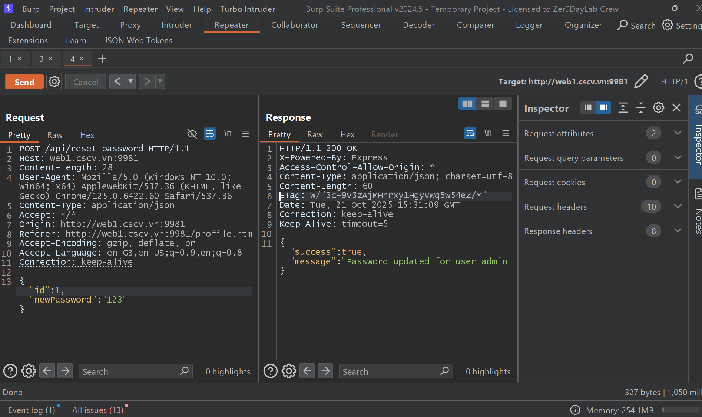
Rồi bây giờ chúng ta có thể đăng nhập với user admin và tiến hành lấy token <br>
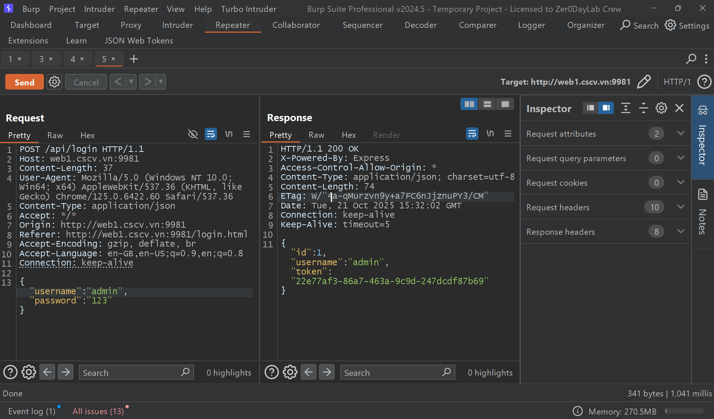
và tiến hành lấy flag thông qua gửi token admin lên và get FLAG thành công <br>
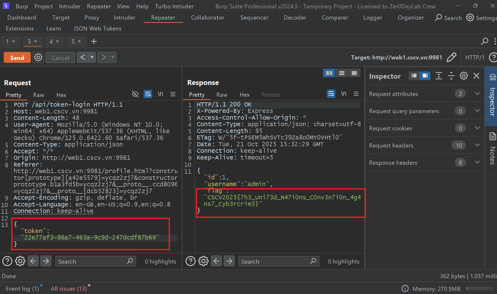
Hazzz Câu này mình làm khá mất time dù nó dễ tại vì nhiều người làm có thể update password admin liên tiếp khiến không thể xác thực được.

# ZC-1
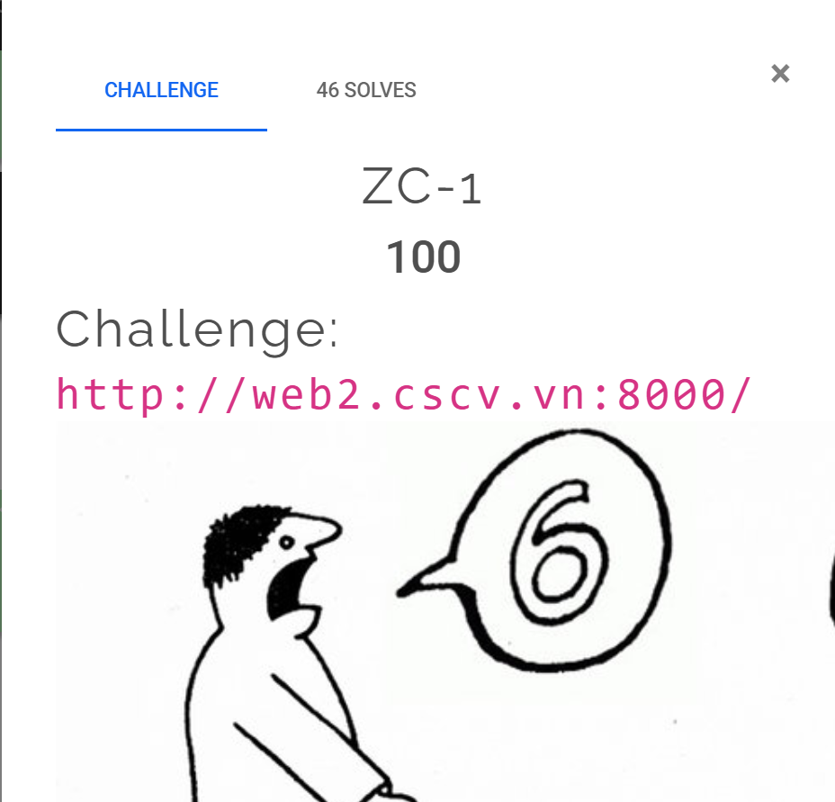
Cùng đi vào phân tích challenge đầu tiên truy cập trang web thì mình thấy nó trả về 404 mình tưởng là challenge lỗi tuy nhiên khi hỏi author thì author bảo nó vậy :v
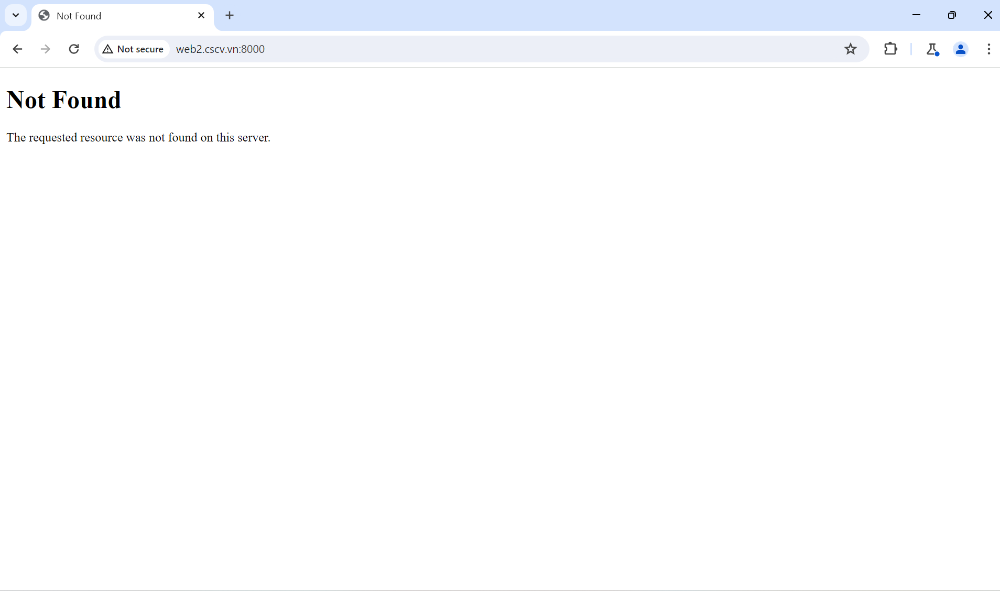
Không làm gì nhiều được ở đây cùng đi sâu vào mã nguồn để phân tích chi tiết tại sao <br>
Mã Nguồn : <a href="https://github.com/capt-bl4ck0ut/Challenge-Web/tree/main/SVANM-2025/ZC_1/public">ZC-1</a> <br>
Mã nguồn nó có 2 phần gồm app1 và app2 trong đó : app1 sử dụng (Django + DRF, port 8000) và app2 sử dụng (PHP Apache, không publish port ra ngoài) khiến ứng dụng trả về 404 not found cũng đúng :v <br>
Sau khi xem qua cấu trúc của app1 nó có các tuyến đường <b>/gateway/user/</b> dùng để tạo user mới <br>
```py
from django.urls import path, include
from rest_framework.routers import DefaultRouter
from .views import *
# from . import views

gateway_router = DefaultRouter()
gateway_router.register('', GatewayViewSet, basename='gateway')

user_router = DefaultRouter()
user_router.register('', UserViewSet, basename='user')

urlpatterns = [
    path('', include(gateway_router.urls)),
    path('user/',include(user_router.urls))
    # path('auth')
]
```
Với các tham số username, password, email tương ứng : <br>
```py
from rest_framework import serializers

from gateway.models import User


class UserSerializer(serializers.ModelSerializer):
    class Meta:
        model = User
        fields = ['username', 'email']


class AuthSerializer(serializers.ModelSerializer):
    email = serializers.EmailField(required=False)
    class Meta:
        model = User
        fields = ['username', 'email','password']
```
Ở tuyến đường <b>/auth/token/</b> để lấy token hoặc tái tạo lại token của user vừa tạo <br>
```py
urlpatterns = [
    [....]
    path('auth/token/', TokenObtainPairView.as_view(), name='token_pair'),
    path('auth/refresh-token/', TokenRefreshView.as_view(), name='token_refresh'),
]
```
Sau đó chúng ta có thể truyền dữ liệu thông qua tuyến đường <b>/gateway/transport</b> nhận 1 file nén từ người dùng <br>
```py
 @action(detail=False, methods=['post'], url_path='transport')
    def transport(self, request: Request, *args, **kwargs):

        file = request.FILES["file"].file
        if not check_file(file):
            return Response(data="Invalid file")
        file.seek(0)
        msg = transport_file(str(request.user.id), file)

        return Response(data=msg)
```
Sau đó gọi hàm checkfile kiểm tra loại file kết thúc được cho phép <br>
```py
STORAGE_URL = env("STORAGE_URL",default="http://127.0.0.1:8002")
ALLOW_STORAGE_FILE = (".txt",".docx",".png",".jpg",".jpeg")
```
```py

def check_file(file):
    try:
        with zipfile.ZipFile(file,"r") as zf:
            namelist = zf.namelist()
            if len([f for f in namelist if not f.endswith(allow_storage_file)]) > 0:
                return False
    except:
        return False

    return True
```
sau đó gọi <b>transport_file()</b> đẩy thẳng file sang <b>app2/src/storage.php</b>
```py
def transport_file(id, file):
    try:
        res = requests.post(
            url= storage_url + "/storage.php",
            files={
                "id":(None,id),
                "file":file
            },
            allow_redirects=False,
            timeout=2
        )
        return "OK"
    except Exception as e:
        return "ERR"
```
Tiếp theo nó sẽ gọi đến <b>/gateway/health?module=...</b> gọi requests.get(STORAGE_URL + module) rồi chỉ trả “OK/ERR” theo HTTP status, không trả body.
```py
def health_check(module):
    try:
        res = requests.get(storage_url + module, timeout=2)
        if res.status_code == 200:
            return True
        return False
    except:
        return False
```
Và còn ở app2 ở file <b>storage.php</b> dùng thư viện <b>gemorroj/archive7z</b> bọc 7-Zip để giải nén đúng file chúng ta upload vào <b>/var/html/storage/<id></b> (id là UID của user)
```php
<?php

require "vendor/autoload.php";

use Archive7z\Archive7z;

if(isset($_POST['id']) && isset($_FILES['file'])){
    $storage_dir = __DIR__ . "/storage/" . $_POST['id'];

    if(!is_dir($storage_dir)){
        mkdir($storage_dir);
    }

    $obj = new Archive7z($_FILES["file"]["tmp_name"]);
    $obj->setOutputDirectory($storage_dir);
    $obj->extract();
}
?>
```
Với những điều đã phân tích chi tiết trên và sau quá trình tìm hiểu tôi phát hiện được có lỗ hổng ở 7z khi giải nén có thể sử dụng symlink để ghi đè file tùy ý khiến <a href="https://security.snyk.io/research/zip-slip-vulnerability?utm_source=chatgpt.com">7z</a> và chúng ta có thể build POC như trang này <a href="https://book.jorianwoltjer.com/forensics/archives#zip-file-extracting-as-7z">POC</a>
## Khai thác.
Rồi bây giờ cùng tạo user để lấy token và UID tương ứng <br>
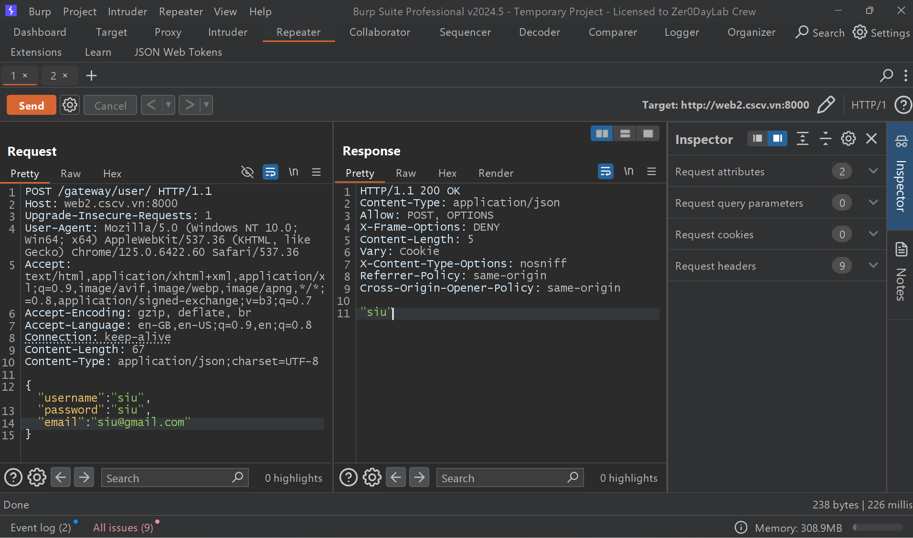
Tiến hành gọi /auth/token để xác thực token với username và password của user vừa tạo. <br>
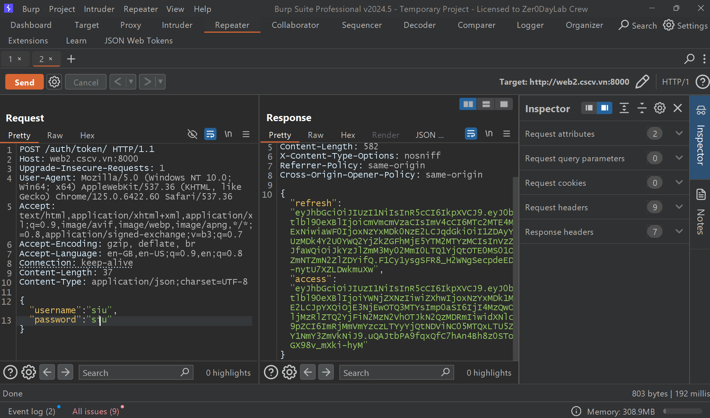
Lấy user_id <br>
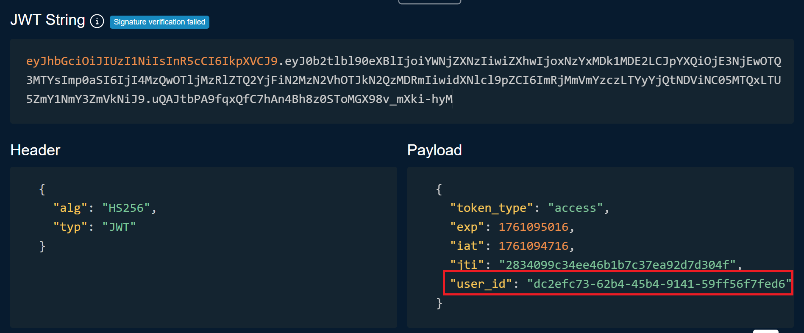
Rồi tiếp theo chúng ta có quy trình khai thác <br>
1. Đầu tiên chúng ta tạo file hợp lệ ở app1 để qua check nén nó trong file zip <br>
2. Sau đó tạo 1 file revershell <a href="https://pentestmonkey.net/tools/web-shells/php-reverse-shell?utm_source=chatgpt.com">Revershell PHP</a> sử dụng 7z để zip lại <br>
3. Sau đó đưa 2 file vào 1 file tùy ý <br>
4. Tiến hành upload shell <br>
5. Sau đó gọi gateway/health/?module=/storage/$USER_ID/shell.php để kích hoạt shell của chúng ta đưa vào <br>
Sau đây mình sẽ làm tổng hợp với các quy trình đã nói như trên theo từng bước như sau: <br>
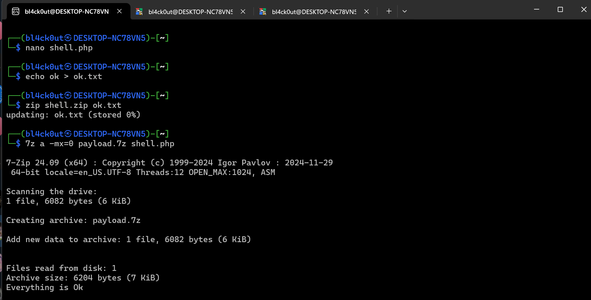
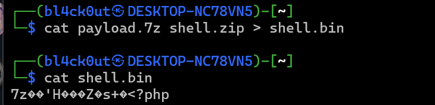
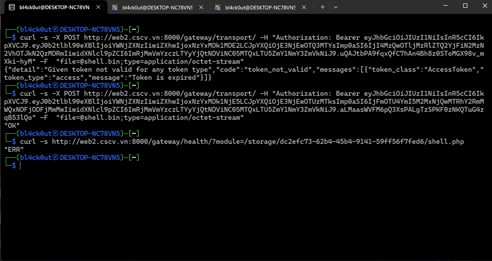
Bây giờ ở server revershell đã nhận shell thành công từ phần trigger của chúng ta <br>
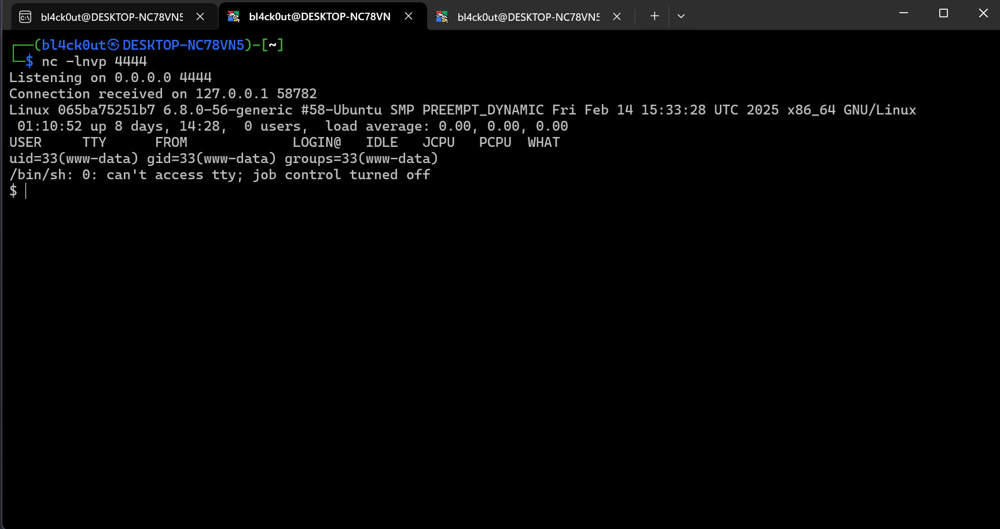
Sau đó tương tác với lệnh thì mình thu được FLAG: <br>
<b>CSCV2025{Z1p_z1P_21p_Ca7_c47_c@t__}</b> <br>
Bài này mình khá đáng tiếc khi giải ra ở phút cuối nên chưa submit được :v

## PortfolioS
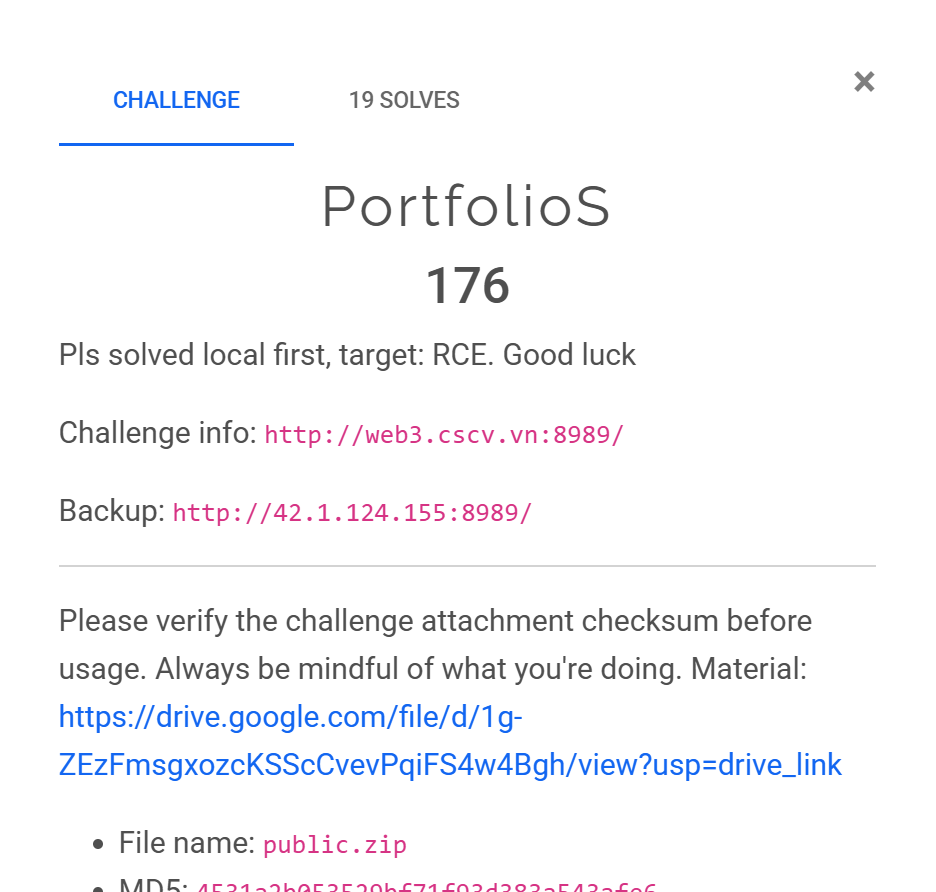
Đầu tiên vào challenge thì nó sẽ hiển thị trang đăng nhập và đăng kí chúng ta cùng thử tạo 1 user mới sau khi đăng nhập nó chuyển hướng đến trang chính và ở lịch sử HTTP như sau <br>
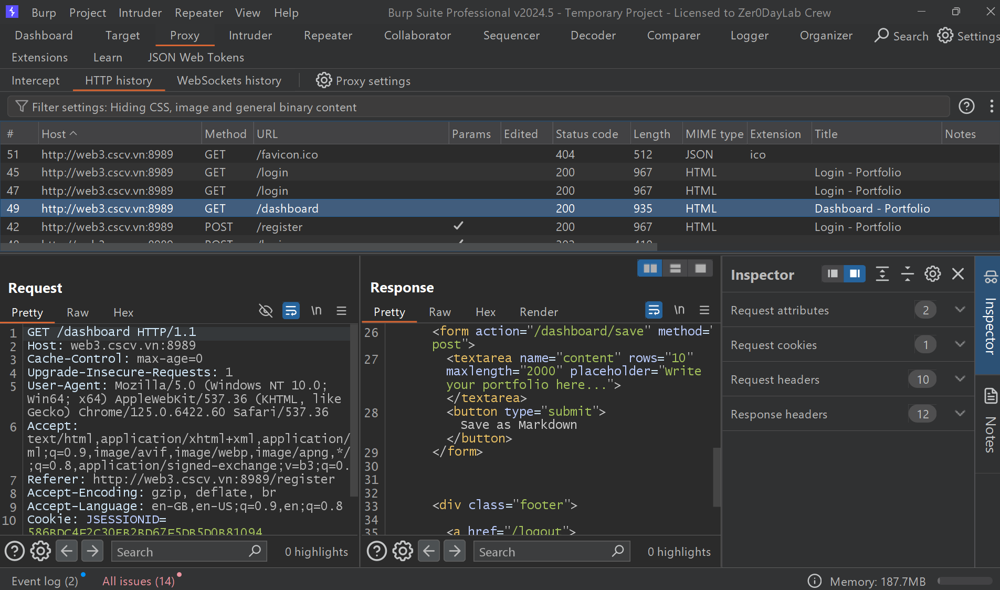
Sau khi nhập giá trị bất kì nó sẽ lưu theo dạng portfolio_<RANDOM>.md và có chức dowload
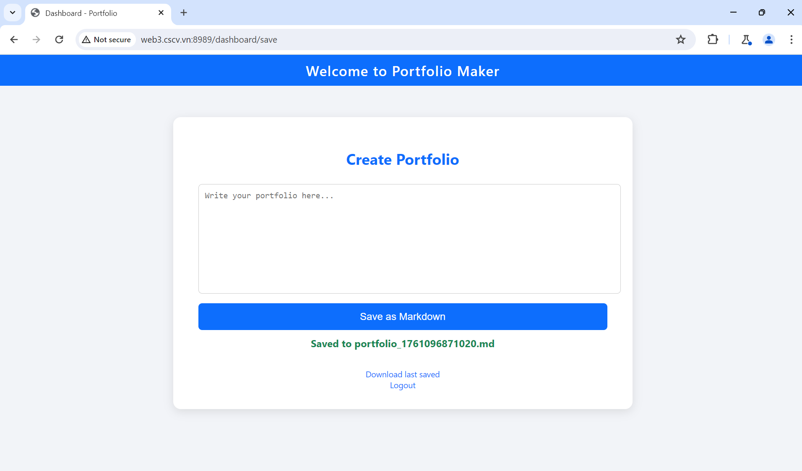
Và giá trị được dowload có format của file md như sau: <br>
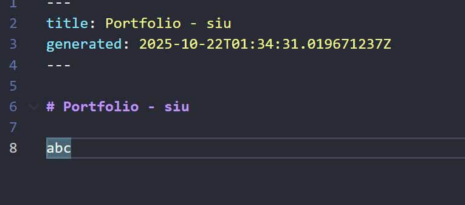
KHông làm gì nhiều được ở đây chúng ta cùng đi vào phân tích <link href="https://github.com/capt-bl4ck0ut/Challenge-Web/tree/main/SVANM-2025/PortfolioS">Mã Nguồn</link> <br>
Đầu tiên chúng ta sẽ tìm lá cờ được nằm ở đâu đầu tiên thì tôi thấy trong Dockerfile lá cờ được tạo giá trị ngẫu nhiên có 16 kí tự và ứng dụng được chạy bằng java và challenge này hint từ tác giả là được viết bằng SpringBoot<br>
```dockerfile
FROM openjdk:17-jdk-slim

WORKDIR /app

COPY portfolio.war portfolio.war
COPY flag.txt /flag.txt

RUN groupadd -r webgroup && \
    useradd -r -g webgroup -m -d /home/web web && \
    mkdir -p /app/data && \
    chown -R web:webgroup /app && \
    chmod 555 /app/portfolio.war && \
    chmod 770 /app/data && chown web:webgroup /app/data && \
    RAND_NAME=$(tr -dc A-Za-z0-9 </dev/urandom | head -c 16) && \
    mv /flag.txt "/${RAND_NAME}" && \
    rm -f /flag.txt && \
    chown root:root "/${RAND_NAME}" && chmod 444 "/${RAND_NAME}"

USER web

EXPOSE 8989

ENTRYPOINT ["java", "-jar", "/app/portfolio.war"]
```
Ở tuyến đường nginx chúng ta có thể thấy nó sẽ chặn chúng ta vào /internal/testConnection <br>
```nginx
events {}

http {
    server {
        listen 80;

        location = /internal/testConnection {
            return 403;
        }

        location / {
            proxy_pass http://app:8989;

            proxy_set_header Host $host:8989;
            proxy_set_header X-Real-IP $remote_addr;
        }
    }
}
```
Sau khi tìm hiểu thì tôi thấy server sử dụng phiên bản nginx: <b>nginx/1.20.2</b> <br>
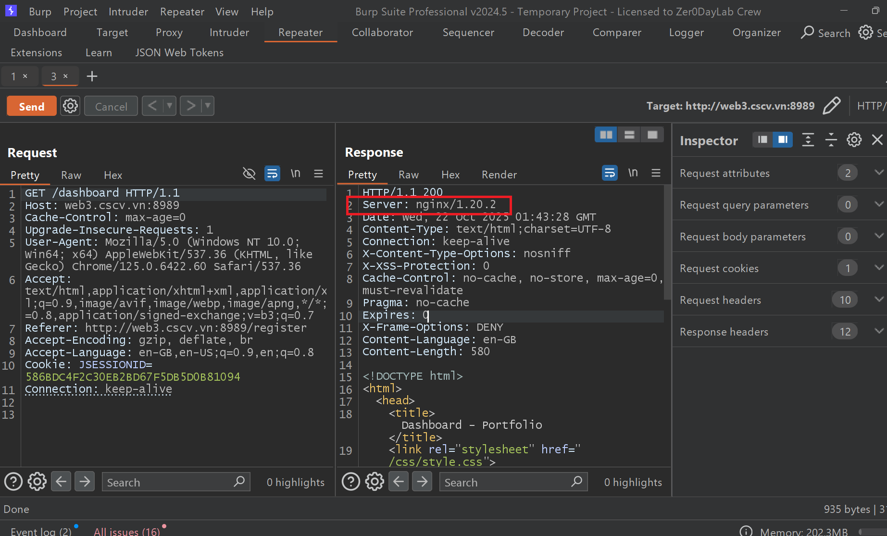
Sau khi tìm hiểu tôi tìm được tài liệu <a href="https://blog.bugport.net/exploiting-http-parsers-inconsistencies">Exploiting HTTP Parsers Inconsistencies</a> có thể bypass nó trong Spring Boot bằng cách sử dụng kí tự <b>\x09</b> ở đây SpringBoot sẽ loại bỏ kí tự nhưng về server nginx thì không khiến chúng ta có thể bypass được và cùng thực hiện như sau: <br>
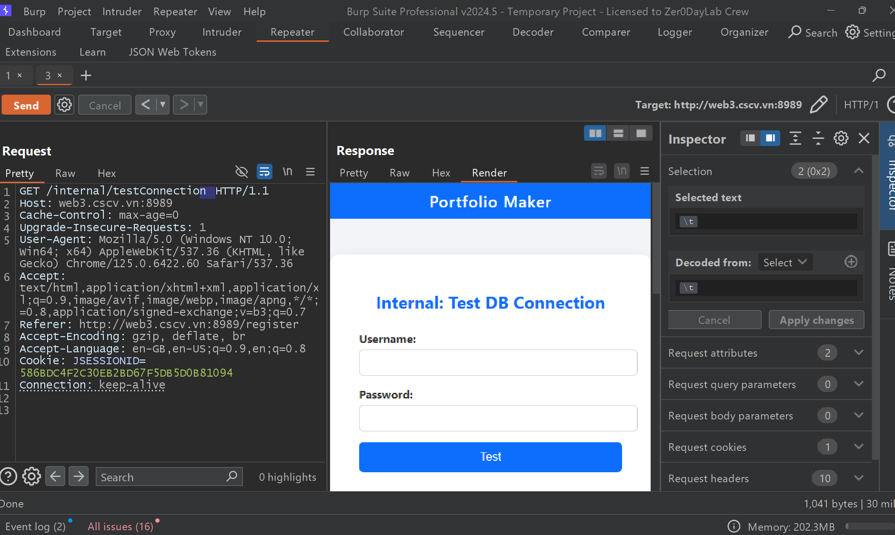
Sau đó nhập tham số username và password ngẫu nhiên thì nó sẽ thông báo lỗi: vâng chúng ta có thể xem mã nguồn ở tuyến đường internal này xem<br>
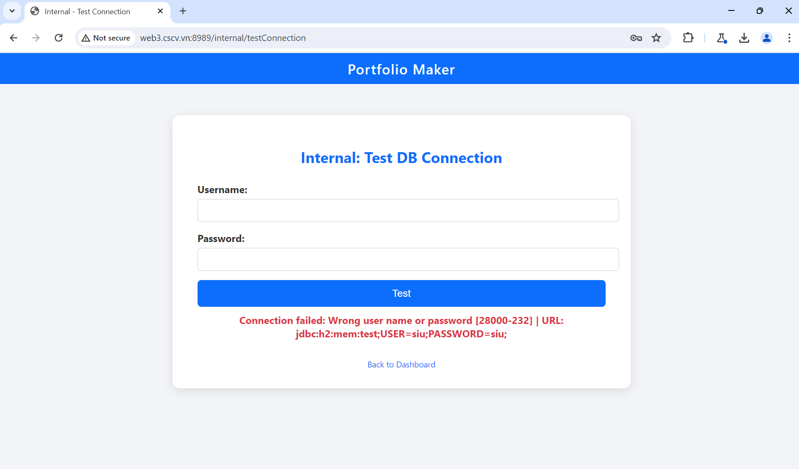
Ở mã nguồn chúng ta có thể thấy ứng dụng này nó sử dụng username và password được nối trực tiếp vào tham số mà không có sự lọc đầu vào khiến attacker có thể chèn lệnh để RCE <br>
```java
   @PostMapping({"/testConnection"})
   public String testConnection(@RequestParam String username, @RequestParam String password, Model model) {
      if ((username + password).length() >= 95) {
         model.addAttribute("error", "Username + password to long.");
         return "internal";
      } else {
         String baseUrl = "jdbc:h2:mem:test;";
         String fullUrl = baseUrl + "USER=" + username + ";PASSWORD=" + password + ";";
```
Với lại nó sử dụng 1 thông báo lỗi chung khiến có thể leak thông tin qua thông báo lỗi của nó
```java
 try {
               model.addAttribute("message", "Connected successfully to: " + fullUrl);
               var7 = "internal";
            } catch (Throwable var10) {
               if (conn != null) {
                  try {
                     conn.close();
                  } catch (Throwable var9) {
                     var10.addSuppressed(var9);
                  }
               }

               throw var10;
            }

            if (conn != null) {
               conn.close();
            }

            return var7;
         } catch (Exception var11) {
            String var10002 = var11.getMessage();
            model.addAttribute("error", "Connection failed: " + var10002 + " | URL: " + fullUrl);
            return "internal";
         }
      }
```
Sau khi xem xét tìm hiểu tôi biết được ứng dụng này dính lỗ hổng <b>H2 JDBC Connection String Injection → RCE</b> nhưng khi tới đây tôi tìm hiểu tìm cách gọi <b>ALIAS EXEC</b> để thực thi hay thậm chí ghi file nhưng chưa khiến ứng dụng Trigger RCE được [......] <br>
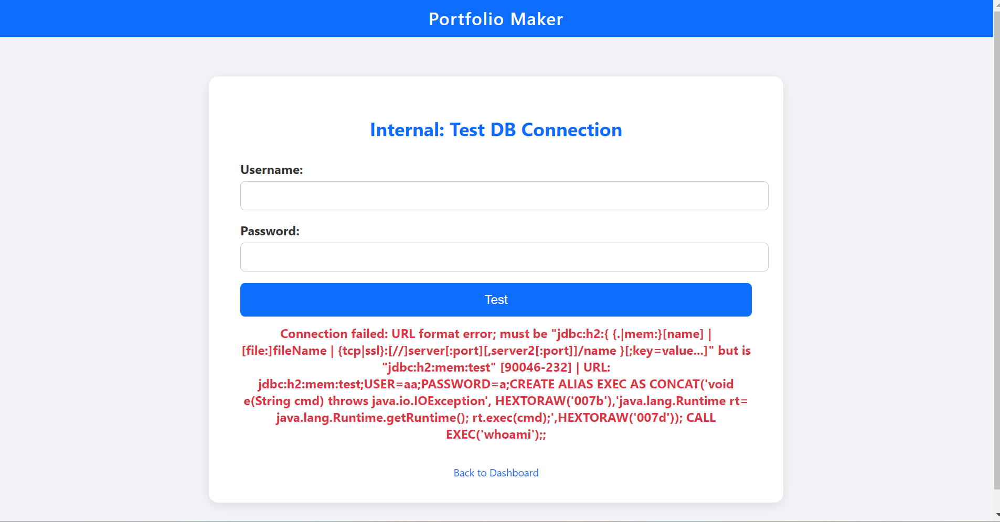